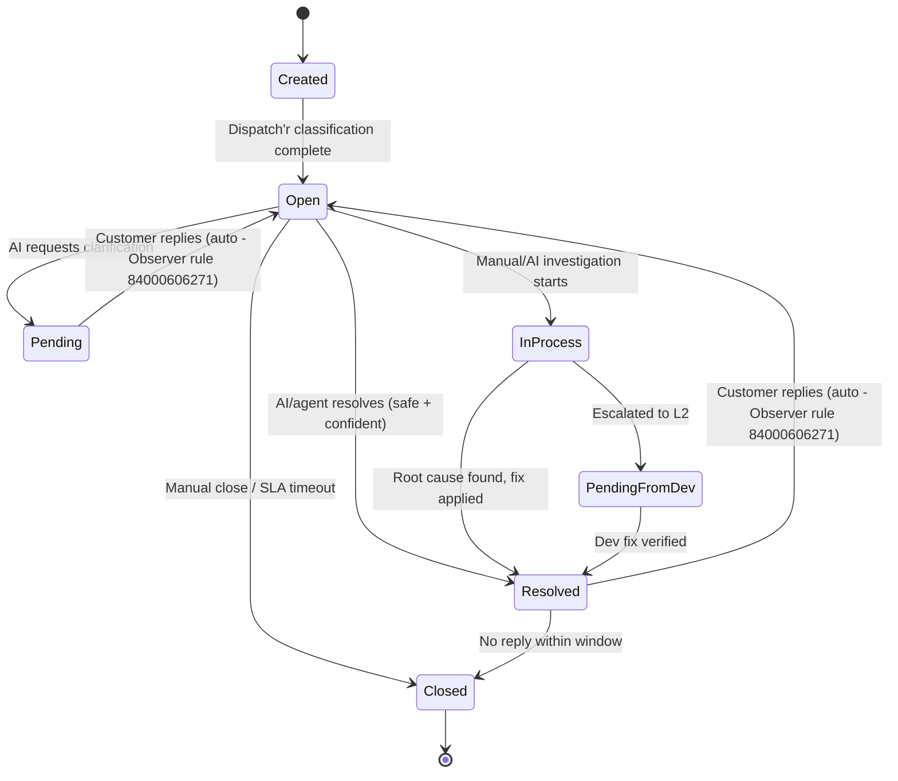

# Freshdesk Ticket Lifecycle

**Source**: Live Freshdesk production audit 2026-06-18 (kwikid.freshdesk.com)  
**Instance**: kwikid.freshdesk.com

---

## 1. Full Ticket Lifecycle Narrative

```
[Ticket Created]
       │
       │  Dispatch'r rules fire (position order):
       │  → cf_clients set (tenant identification)
       │  → group set (L1, L2, BA, Tech Assign, General)
       │  → default agent assigned
       │  → tags added (auto_assigned_client, etc.)
       │  → AI webhook fired (if scope matches)
       │
       ▼
  [Open — status 2]
       │
       │  AI Support Agent Runtime runs (Golden Path):
       │  → Client Resolution → Ticket Orchestrator
       │  → Investigation / Knowledge Retrieval / Reasoning
       │
       ├─────────────────────────────────────────────────────────┐
       │                                                         │
       ▼ (High confidence, safety gate passes)                  ▼ (Missing info / low confidence)
  [Reply sent → Resolved — status 4]                     [Clarification sent → Pending — status 3]
       │                                                         │
       │                                                         │  Customer replies
       │                                                         │  Observer rule 84000606271 fires:
       │                                                         │  → status: Pending → Open (auto)
       │                                                         │  → Observer webhook fires (MISSING — must create)
       │                                                         │
       │                                                         ▼
       │                                                  [Open — status 2]
       │                                                  (clarification loop resumes)
       │                                                         │
       └──────────────────────────────────────────────────────── ┤
                                                                  │
                                                                  ▼ (Escalation needed)
                                                    [In Process — status 10]
                                                                  │
                                                    ┌─────────────┼────────────────────────────┐
                                                    ▼             ▼                            ▼
                                         [Pending from Dev    [Pending from L1     [Pending from support
                                          — status 6]          — status 8]          — status 11]
                                                    │             │
                                                    ▼             ▼
                                                  [Resolved — status 4]
                                                          │
                                                          │  No further customer reply
                                                          │  (or manual close)
                                                          ▼
                                                   [Closed — status 5]
```

---

## 2. Status Model

There are **11 status values** in the live instance.

| Status ID | Label | Freshdesk Display Text | Workflow Meaning | SLA Clock |
|:---:|:---|:---|:---|:---|
| `2` | **Open** | "Being Processed" | Active, awaiting triage or new response | ▶ Running |
| `3` | **Pending** | "Awaiting your Reply" | Blocked waiting on customer | ⏸ Paused |
| `4` | **Resolved** | "This ticket has been Resolved" | Solution sent; customer can reopen by replying | ⏸ Paused |
| `5` | **Closed** | "This ticket has been Closed" | Permanently locked | — |
| `6` | **Pending from Development Team** | — | Escalated to L2 engineering, awaiting dev action | ⏸ Paused |
| `7` | **Pending from Client** | — | Waiting on enterprise client/partner | ⏸ Paused |
| `8` | **Pending from L1** | — | Assigned to frontline team for a check | ⏸ Paused |
| `9` | **Pending from L2** | — | Waiting on a developer response | ⏸ Paused |
| `10` | **In Process** | — | Active investigation underway | ▶ Running |
| `11` | **Pending from support** | — | Internal L1 review in progress | ⏸ Paused |
| `12` | **Hold** | — | Parked; not actively worked | ⏸ Paused |

### AI status usage guidance

The AI should default to these three primary statuses:
- `Open` (2) — active state
- `Pending` (3) — when requesting clarification from customer
- `Resolved` (4) — when a solution has been sent

Leave the more granular Pending sub-states (6, 7, 8, 9, 11, 12) to human agents unless explicitly directed.

### Status-changing rules

To move a ticket to `Resolved` (4) or `Closed` (5), these fields must already be populated:
- `cf_clients`
- `ticket_type`
- `cf_sop_status`
- `cf_resolution_classification`

A `PUT /api/v2/tickets/{id}` that sets `"status": 4` without these populated will return **HTTP 422**. The Execution Layer must validate all required closure fields are set *before* attempting the status-changing call.

---

## 3. State Machine



---

## 4. Events That Trigger Automations

### 4.1 Ticket creation events

| Event | Triggered Rules | Impact on AI |
|:---|:---|:---|
| Ticket created from email domain matching a named client | Named-client Dispatch'r rule | Sets `cf_clients`, group, default agent, tags |
| Ticket created from unknown domain / `cf_clients = "Others"` | "AI auto replies" rule | Fires AI webhook to n8n |
| Ticket created with OTP subject (Unity) | "Unity OTP - VKYC Portal Login OTP" | Auto-closes ticket; AI should never see this |
| Ticket created with alert-format subject | Several alert-closing rules | Auto-closes ticket; AI pre-filter catches `alert` tag |
| Ticket created from `postmaster@think360.ai` | "postmaster@think360.ai" rule | Auto-closes ticket |
| Ticket created with recall/auto-reply indicators | "Closing Recall or Automatic Mails" | Closes + marks spam |
| Ticket created by BA-related TO/CC | "BA assignment rule" | Routes to Business Analyst group |

### 4.2 Ticket update events (Observer rules)

| Event | Observer Rule | Rule ID | Active | Impact |
|:---|:---|:---:|:---:|:---|
| Agent is NONE when ticket updated | Auto-assign first responder | 84000606270 | ✅ | Assigns ticket to whichever agent acted first — AI must use dedicated account |
| Customer replies when ticket is not Open | Auto-reopen on customer reply | 84000606271 | ✅ | Flips status to Open (2), emails assigned agent |
| Ticket assigned to L2 or Tech Assign | Add watcher to L2/Tech Assign tickets | 84000607316 | ✅ | Adds event-performing agent as watcher |
| Customer has replied 5–9 times | Avoid escalations due to frustration | 84000621699 | ✅ | Adds watchers (Sumati Nadar, Shubham Singh), emails Sumati |
| Customer replies to closed ticket | Create new ticket on reply to closed | 84000622013 | ❌ | Creates new ticket — INACTIVE |
| Status changes to Closed | Create new ticket via webhook | 84000606273 | ❌ | Tags `new_ticket_webhook`, sets Open — INACTIVE |
| Group changes to Tech Assign | Send auto mail when moved to L2 | 84000607319 | ❌ | Sends reply via email — INACTIVE |
| Status is Open/Pending/etc | Predicted Priority via API | 84000620617 | ❌ | Webhook to predict.test.getkwikid.com — INACTIVE |
| Status Closed + specific requester | Copy of create new ticket | 84000621230 | ❌ | Webhook to Freshdesk tickets API — INACTIVE |
| Status is Open | L1 first response note | 84000622583 | ❌ | Webhook to ai.dnyan.cloud — INACTIVE |

### 4.3 Hourly time-trigger events (Supervisor rules)

| Event | Supervisor Rule | Rule ID | Active | Impact |
|:---|:---|:---:|:---:|:---|
| Ticket created/pending for > 1h | 1 Hour Created or Pending | 84000607012 | ✅ | Emails assigned agent |
| Ticket Open + group L2/Tech Assign + > 1h since reopened | Re-Assign L2→L1 | 84000607317 | ✅ | Assigns to L1, tags `Reopened` |
| Client is NONE | Empty client check and assign to L2 | 84000614292 | ❌ | Assigns to L2 — INACTIVE |
| Ticket type is Issues | Hourly assignment | 84000621615 | ❌ | Assigns to L1 — INACTIVE |

---

## 5. Lifecycle Events the AI Must Handle

### 5.1 New ticket (primary path)

1. AI receives webhook via n8n → FastAPI
2. HMAC signature verified
3. Payload normalized (tags split, IDs cast to string, `ticket_custom_fields` → `custom_fields`)
4. Pre-filters applied: skip closed, skip noise tags (`alert`, `daily-report`, `mtd`)
5. Idempotency record persisted
6. `200 OK` returned immediately
7. Golden Path spawned as background task
8. Execution Layer writes back: note + reply + field updates + status change

### 5.2 Customer reply (clarification resume path)

1. Observer rule detects customer reply (`incoming: true, private: false`)
2. Observer webhook fires to AI endpoint
3. Webhook Receiver reads `latest_comment.incoming = true` to detect this is a customer reply
4. `ConversationStateStore` loads `conversation_state` for `ticket_id` from Supabase
5. If `status = "AWAITING_CUSTOMER"`, inject customer reply into slot state and resume Golden Path
6. If `status = "IN_PROGRESS"` (ticket already being handled), serialize — wait for first run to complete

### 5.3 Events AI ignores

- `latest_comment.incoming = false, private = false` — agent reply (AI's own reply echoed back)
- `latest_comment.private = true` — internal note
- Any ticket with `status = 5` (Closed)
- Any ticket tagged `alert`, `daily-report`, or `mtd`

---

## 6. Required Fields for Ticket Closure

All of these must be populated before `status = 4 (Resolved)` or `status = 5 (Closed)` can be set:

| Field | API Name | Required For | Who Sets It |
|:---|:---|:---|:---|
| Client / Tenant | `cf_clients` | Closure | Dispatch'r rules (read-only for AI) |
| Ticket Type | `type` | Closure | AI or human agent |
| SOP Status | `cf_sop_status` | Closure (required for agents) | AI (WRITE scope) |
| Resolution Classification | `cf_resolution_classification` | Closure | AI (WRITE scope) |

### Closure write sequence (Execution Layer)

```
1. Validate cf_clients is set (read from ticket state)
2. Validate ticket_type is set (AI sets to "Issues" if not already)
3. Set cf_sop_status (based on Knowledge Layer result)
4. Set cf_resolution_classification (based on resolution outcome)
5. Set cf_rca_status (based on root cause analysis)
6. Set cf_query_type (AI classification)
7. Set cf_issue_area (AI classification)
8. Set cf_portal (AI inference)
9. Set cf_handling_time (AI processing time in minutes)
10. Set cf_review_ticket ("No" for high-confidence, "Yes" for low-confidence)
11. PUT status=4 (Resolved) in same or subsequent API call
```

Do NOT set `status = 4` in a separate call before the custom fields are set. Combine in a single `PUT` or ensure fields are set first.

---

## 7. SLA Behavior

| Status | SLA Clock |
|:---|:---|
| Open (2) | ▶ Running toward `fr_due_by` (first response) and `due_by` (resolution) |
| Pending (3) | ⏸ Paused — customer's turn, SLA not consuming time |
| In Process (10) | ▶ Running |
| Pending from Dev (6) | ⏸ Paused |
| Pending from Client (7) | ⏸ Paused |
| Pending from L1 (8) | ⏸ Paused |
| Pending from L2 (9) | ⏸ Paused |
| Pending from support (11) | ⏸ Paused |
| Hold (12) | ⏸ Paused |
| Resolved (4) | ⏸ Paused |
| Closed (5) | — Not applicable |

- `fr_due_by` — first-response SLA deadline (typically short, minutes-to-hours)
- `due_by` — resolution SLA deadline

Urgent (priority 4) tickets have shortest SLA windows. Moving a ticket to `Pending` immediately pauses the SLA clock — important for the clarification loop flow.

---

## 8. Reopen Behavior

**Automatic reopen**: Observer rule 84000606271 fires whenever:
- An incoming email (not automatic) is received
- AND the ticket status is NOT Open

Action: sets status to Open (2), emails the assigned agent.

The AI does NOT need to flip a Pending or Resolved ticket back to Open when the customer replies — Freshdesk does this automatically. The AI only needs to detect the update webhook and resume its pipeline.

---

## 9. Priority Model

| Priority ID | Label | Mapped Value | SLA Implication |
|:---:|:---|:---|:---|
| `1` | Low | `low` | Longest response/resolution target |
| `2` | Medium | `medium` | Standard target |
| `3` | High | `high` | Escalated target — default for BOB, RBL Auditor Hold |
| `4` | Urgent | `urgent` | Immediate response required — downtime alerts |

**AI rule**: Do not downgrade a priority already set by a Dispatch'r rule or human agent. Urgent (4) or any ticket with `cf_impact = "DOWNTIME 100% impact"` or `"Client Escalation"` must escalate to Asana rather than attempt autonomous resolution.

---

## 10. Ticket Types

| Ticket Type | API Value | AI Actionability |
|:---|:---|:---|
| Issues | `"Issues"` | Primary AI-actionable type |
| Custom Change Request | `"Custom Change Request"` | Route to Business Analyst — AI does NOT resolve CRs |
| Login | `"Login"` | AI-actionable (authentication issues) |
| Logout | `"Logout"` | AI-actionable |
| BA BAU | `"BA BAU"` | BA workflow — not AI support ticket |
| Feedback | `"Feedback"` | Not a defect — no resolution action |
| Service Task | `"Service Task"` | Evaluate case-by-case |
| Internal mail | `"Internal mail"` | Skip — not customer support |

**When writing `ticket_type`**: Only use one of the 8 confirmed-valid values above. Some live Dispatch'r rules set non-standard values (`P1`, `Incident`, `Feature Request`, `P4`) — tolerate these gracefully on reads but never write them.

---

## 11. Groups Reference

| Group | ID | Role in Lifecycle |
|:---|:---|:---|
| **L1** | `84000293343` | Frontline triage. Default landing zone for nearly all per-client rules. AI operates here. |
| **L2** | `84000293342` | Engineering escalation. AI escalates here when dev action required. |
| **Tech Assign** | `84000293351` | Platform/development escalation. |
| **Business Analyst** | `84000294040` | Requirements / Custom Change Requests. Route CRs here. |
| **General** | `84000293360` | Alerts, scheduled reports. AI ignores tickets in this group. |

**AI operational rule**: Only act on tickets in **L1**. Tickets already in L2, Tech Assign, or Business Analyst have been escalated beyond AI's auto-resolution scope — write note-only unless architecture is explicitly extended to cover that group.
