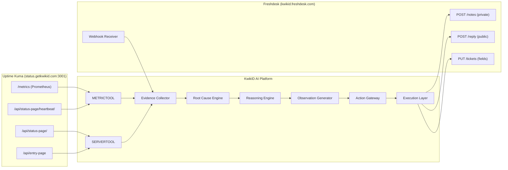

# Relationship Graph — Service Dependencies and Monitoring Flow

**Platform**: Uptime Kuma **1.23.15** at `http://status.getkwikid.com:3001`  
**Source**: Live authenticated extraction 2026-07-11 + KwikID flow_diagram.mermaid + SUPPORT_OPERATIONS_BLUEPRINT.md

---

## 0. Live Client → Status Page → Monitor Map (2026-07-11)

Each bank client has a dedicated public status page, backed by its own monitor set. The `parent`/`childrenIDs` fields also define 2 explicit monitor groups.

| Client | Status page slug | Monitors | Active | Prod status |
|:---|:---|:--:|:--:|:---|
| KwikID Core / Shared | `global` | 78 | 63 | Healthy |
| Bank of Baroda / BOBCards | `bob` | 45 | 39 | Healthy (UAT under weekend maintenance) |
| Unity Bank | `unity-bank` | 40 | 40 | Healthy (New Unity fleet in maintenance) |
| RBL Bank | `rbl` | 35 | 34 | Healthy (some RBL mem-space monitors flapping, 50–88% uptime) |
| FINO | `fino` | 28 | 22 | Healthy |
| NRFSI | `nrfsi` | 18 | 11 | Partial (UAT paused) |
| Bajaj | `bajaj` | 17 | 15 | 1 DOWN (monitoring server, HTTP 500); prod under maintenance |
| CBI | `cbi` | 15 | 13 | Healthy |
| ICICI | `icici` | 15 | 2 | Mostly paused (pre-deployment) |
| Tata Capital | `tatacap` | 14 | 0 | **Dormant — all paused** |
| Canara | `canarabank` | 11 | 10 | Healthy |
| SaaS / SFU media | (in `global`) | 13 | 12 | Healthy |
| RRB / Shinhan / Svamaan | — | 3 | 2 | Minimal coverage |

**Explicit groups**: `Saas client` (id 293) and `RBL Bank` (id 390) are `type: group` container monitors.

**Cross-client shared infrastructure** (a DOWN here cascades across tenants): ScyllaDB clusters (`kwikid.vkyc.prod.scylladb.*`, `bob-scylla-master`), shared OCR/ML (`ml.getkwikid.com`, `kwikid.ocr.base`), esign service, billing service, and the shared SFU/LiveKit media servers.

---

## 1. Monitoring Data Flow



---

## 2. KwikID Service Architecture (Expected)

Based on the KwikID platform's known services and the ticket schema context, the following service dependency graph is expected. **Monitor existence to be confirmed with live data.**

```
                      ┌─────────────────────────────────────────────────────┐
                      │              KwikID Platform                        │
                      │                                                     │
                      │  ┌─────────────┐    ┌─────────────────────────┐   │
  Users ──────────────┼─►│  API Server  │───►│  Auth / Token Service   │   │
  (eKYC)              │  └─────────────┘    └─────────────────────────┘   │
                      │         │                      │                   │
                      │         ▼                      ▼                   │
  Agents ─────────────┼─►┌─────────────┐    ┌─────────────────────────┐   │
  (Support Portal)    │  │   Database   │    │   Session Service        │   │
                      │  │  (Primary)   │    │   (VKYC / Video KYC)    │   │
  Admins ─────────────┼─►└─────────────┘    └─────────────────────────┘   │
  (Admin Portal)      │         │                      │                   │
                      │         ▼                      ▼                   │
  Auditors ───────────┼─►┌─────────────┐    ┌─────────────────────────┐   │
  (Auditor Portal)    │  │  Job Queue   │    │   Video / Media Server   │   │
                      │  │  (Workers)   │    │                         │   │
                      │  └─────────────┘    └─────────────────────────┘   │
                      │         │                                          │
                      │         ▼                                          │
                      │  ┌─────────────────────────────────────────┐      │
                      │  │           Storage Service                │      │
                      │  │    (Document upload, KYC artifacts)     │      │
                      │  └─────────────────────────────────────────┘      │
                      │                                                     │
                      │  ┌─────────────────────────────────────────┐      │
                      │  │           n8n Webhook Bridge              │      │
                      │  │  (Freshdesk → FastAPI event routing)     │      │
                      │  └─────────────────────────────────────────┘      │
                      └─────────────────────────────────────────────────────┘

External Dependencies:
  ┌──────────────┐  ┌──────────────┐  ┌──────────────────┐  ┌────────────────┐
  │ UIDAI/Aadhaar│  │  DigiLocker  │  │  SMS Gateway     │  │ Bank APIs      │
  │   API         │  │              │  │  (OTP delivery)  │  │ (Unity, RBL..) │
  └──────────────┘  └──────────────┘  └──────────────────┘  └────────────────┘
```

---

## 3. Tenant → Service Dependency Map

Each tenant uses different KwikID services. A DOWN event in a service affects only the tenants that depend on it:

```
KwikID API Server (core)
  → ALL tenants affected if DOWN
  → Priority: CRITICAL

Database
  → ALL tenants affected if DOWN (cascade failure)
  → Priority: CRITICAL
  → Root cause of: all portals unresponsive, sessions failing, data not loading

VKYC / Video Session Service
  → Tenants using video KYC: Unity Bank, BOB, CBI, others
  → Priority: HIGH
  → Root cause of: "session not visible", "auditor cannot see video", "VKYC failing"

Auth / Token Service
  → ALL tenants affected if DOWN
  → Root cause of: "login not working", "token error", "authentication failed"

Job Queue / Workers
  → Asynchronous operations: session status updates, notification sending, report generation
  → Delayed or stuck sessions, missing notifications
  → Priority: MEDIUM

Storage Service
  → Document upload/retrieval affected
  → Root cause of: "document not uploading", "KYC document missing", "image not loading"
  → Priority: MEDIUM

n8n Webhook Bridge
  → AI automation pipeline affected
  → Root cause of: AI not responding to tickets
  → Priority: HIGH for KwikID platform operations

Unity Bank Integration Endpoint (tenant-specific)
  → UNITY tenant only
  → Root cause of: Unity-specific data failures
  → Priority: HIGH for Unity tickets

RBL Bank Integration Endpoint (tenant-specific)
  → RBL tenant only
  → Priority: HIGH for RBL tickets
```

---

## 4. Monitoring Coverage Map

```
Service                    | Monitored? | Monitor Type | AI Relevance
─────────────────────────────────────────────────────────────────────
KwikID API Server          | UNKNOWN    | http         | CRITICAL
Database                   | UNKNOWN    | tcp/db       | CRITICAL
Auth / Token Service       | UNKNOWN    | http         | HIGH
VKYC Session Service       | UNKNOWN    | http         | HIGH
Video / Media Server       | UNKNOWN    | http/tcp     | HIGH
Job Queue                  | UNKNOWN    | push/http    | MEDIUM
Storage Service            | UNKNOWN    | http         | MEDIUM
n8n Webhook Bridge         | UNKNOWN    | http         | HIGH
Agent Portal               | UNKNOWN    | http         | MEDIUM
Admin Portal               | UNKNOWN    | http         | MEDIUM
Auditor Portal             | UNKNOWN    | http         | MEDIUM
User / eKYC Portal         | UNKNOWN    | http         | MEDIUM
Unity Bank Integration     | UNKNOWN    | http         | HIGH (Unity)
RBL Bank Integration       | UNKNOWN    | http         | HIGH (RBL)
UIDAI / Aadhaar API        | UNKNOWN    | http         | HIGH
SMS Gateway                | UNKNOWN    | http         | MEDIUM
DigiLocker                 | UNKNOWN    | http         | MEDIUM
─────────────────────────────────────────────────────────────────────
All UNKNOWN: requires live access to discover actual monitors configured
```

---

## 5. Cascade Failure Patterns

When a core component fails, it causes cascade failures across dependent services:

### 5.1 Database failure cascade

```
Database DOWN
    │
    ├── API Server → 500 errors on all endpoints
    │       │
    │       ├── Agent Portal → "Cannot load tickets"
    │       ├── Admin Portal → "No data available"
    │       ├── Auditor Portal → "Sessions not loading"
    │       └── User Portal → "KYC submission failing"
    │
    └── Job Queue → Batch jobs fail
            │
            └── Session status updates stuck
```

**Monitoring signature**: Database monitor DOWN → All HTTP monitors transition to DOWN or elevated response time shortly after.

**AI investigation strategy**: If Database monitor is DOWN, all other failures are cascading. Report database outage as the single root cause; do not investigate individual portal issues separately.

### 5.2 Auth service failure cascade

```
Auth / Token Service DOWN
    │
    ├── All authenticated API calls → 401 Unauthorized
    │       │
    │       ├── "Login not working" tickets
    │       ├── "Session expired" tickets
    │       └── "Cannot access portal" tickets
    │
    └── AI pipeline affected → token generation fails
```

**Monitoring signature**: Auth service DOWN → login-related ticket cluster.

### 5.3 n8n webhook bridge failure

```
n8n DOWN
    │
    └── Freshdesk webhooks not delivered to FastAPI
            │
            └── AI not responding to tickets (human agents observe silence from AI)
```

**This does NOT generate Freshdesk support tickets from customers** — it affects KwikID internal operations, not customer-facing service.

---

## 6. Monitoring ↔ Ticket Correlation Matrix

When these monitor combinations are DOWN together, they indicate specific root causes:

| Monitors DOWN (together) | Root Cause | Ticket pattern |
|:---|:---|:---|
| Database + all portals | Database outage | Multiple tickets: "everything down" |
| VKYC Service only | VKYC-specific failure | Tickets: "session not visible", "auditor cannot see" |
| Auth Service only | Authentication failure | Tickets: "cannot login", "token error" |
| Unity Integration only | Unity-specific backend failure | Tickets from @unitybank.co.in users only |
| n8n only | AI pipeline disruption | No customer tickets; internal ops issue |
| All monitors | Platform-wide outage | High-volume ticket cluster, all tenants |
| No monitors | User/session-specific issue | Low-volume, individual ticket |

---

## 7. Evidence Collection Dependency Graph

```
Freshdesk ticket
    │
    ▼
Evidence Collector (parallel)
    │
    ├── METRICTOOL
    │     ├── Requires: status.getkwikid.com:3001 accessible
    │     ├── Requires: slug discovered
    │     ├── Provides: current monitor statuses
    │     └── Provides: outage correlation with ticket time
    │
    ├── SERVERTOOL
    │     ├── Requires: status.getkwikid.com:3001 accessible
    │     ├── Provides: active incident banner
    │     ├── Provides: maintenance windows
    │     └── Provides: monitor grouping by service type
    │
    └── SOPTOOL (SOP / Knowledge Base)
          ├── Requires: Vector DB accessible
          ├── Provides: matching SOP for the symptom
          └── Provides: resolution steps
    
    [Phase 2]
    └── UNITYTOOL (Unity Admin API)
          ├── Requires: Unity API accessible
          ├── Provides: session-level evidence
          └── Provides: user-level investigation data
```

Current production state (Phase 1):
- METRICTOOL: ❌ Network blocked — not yet operational
- SERVERTOOL: ❌ Network blocked — not yet operational  
- SOPTOOL: ✅ Operational (Phase 1)
- UNITYTOOL: ❌ Phase 2 — not yet integrated
