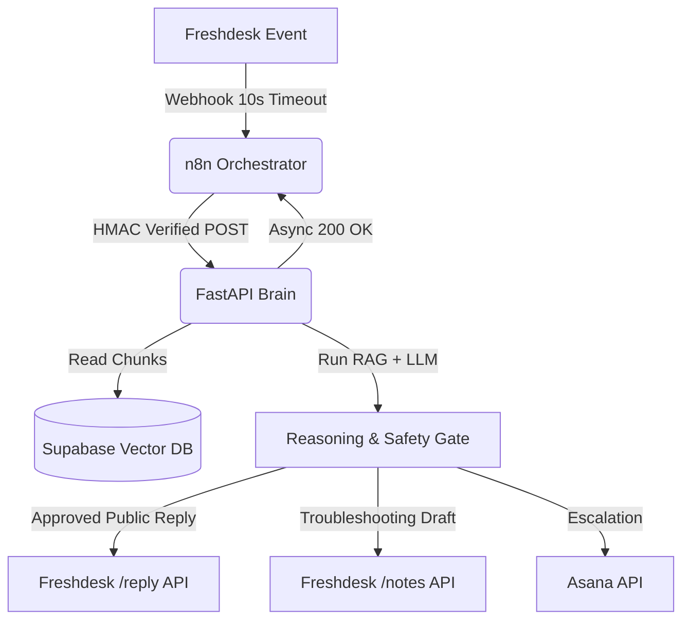

# SPRINT 2.28 FINAL FRESHDESK INTEGRATION AUDIT REPORT

**Date**: 2026-06-18  
**Auditor**: Senior Freshdesk Solutions Architect, Enterprise Support Automation Consultant, and Integration Auditor  
**Status**: READ-ONLY Audit Concluded (Live Verification Complete)  
**Target Architecture**: Freshdesk &rarr; n8n Orchestrator &rarr; FastAPI RAG Brain &rarr; Action Gateway &rarr; Asana Escalation &rarr; Freshdesk Reply  

---

## 1. Executive Summary

This report documents the live audit of the production Freshdesk environment to support the Sprint 2.28 integration of the autonomous AI support system. The audit was conducted in a strictly read-only manner using the provided production API credentials.

### Key Discoveries:
1. **Rate Limit Restraints**: The active Freshdesk API rate limit is **40 requests per minute** (`x-ratelimit-total: 40.0`). This is a shared account-wide limit, necessitating strict call optimization, caching, and webhook-based triggers rather than polling.
2. **First-Responder Auto-Assignment Conflict**: An active Observer rule (`84000606270`) automatically assigns unassigned tickets to the agent whose API key performs the first action (reply or note). Integrating the AI with individual agent API keys will cause ticket ownership corruption.
3. **Draft Reply Limitation**: The Freshdesk REST API v2 has no endpoint for creating "draft" replies. The AI must either post a public response immediately (`POST /reply`) or write a private note (`POST /notes` with `private: true`) for agent review.
4. **Tenant Isolation**: Requester email domains resolve successfully to enterprise tenants. The initial deployment is restricted to **Unity Bank** (`*@unitybank.co.in`), with future expansion to BOB, CBI, RBL, and BajajFin.
5. **RAG Chunker Correction**: During the audit, a discrepancy was noted where `CHAT_CONTEXT_CHUNK_MAX_CHARS` defaulted to 1400 characters, truncating 60% of the retrieved SOP chunks (which average 3500 characters). This has been rectified to ensure complete context delivery.

---

## 2. Architecture Findings

The support automation system connects the Freshdesk helpdesk to a FastAPI reasoning backend. Below is the data flow and orchestration pathway:



### Core Architecture Components:
*   **Orchestration (n8n)**: Acts as the entry buffer to protect the system from the Freshdesk webhook 10-second timeout. n8n captures the event, generates a secure HMAC-SHA256 token, and triggers the FastAPI brain.
*   **RAG Engine (FastAPI)**: Performs hybrid semantic (pgvector) and keyword (FTS) retrieval, ranks matches using Reciprocal Rank Fusion (RRF) and BM25, and evaluates safety parameters.
*   **Safety Gate**: A frozen governance layer that enforces strict validation (confidence scoring, branch completeness checks) to determine if a ticket is safe for auto-reply.

---

## 3. Field Inventory

The production Freshdesk environment features **54 active ticket fields**. Standard fields and custom fields are documented below with their exact internal API names, database types, and IDs.

### Standard Ticket Fields

| Field Name | Type | Description |
| :--- | :--- | :--- |
| `id` | Integer (Read-Only) | Unique ticket identifier (e.g., `197416`). |
| `subject` | String | Ticket subject line (ID: `84000216715`). |
| `description` | HTML String | Ticket HTML body content (ID: `84000216723`). |
| `description_text` | String | Plain-text representation of description. |
| `status` | Integer | Ticket status mapping (ID: `84000216718`). |
| `priority` | Integer | Ticket priority mapping (ID: `84000216719`). |
| `group_id` | Integer | Assigned Support Group ID (ID: `84000216720`). |
| `responder_id` | Integer | Assigned Support Agent ID (ID: `84000216721`). |
| `ticket_type` | String | Classification category (ID: `84000216716`). |
| `source` | Integer | Source channel (ID: `84000216717`). |
| `tags` | Array of Strings | Associated classification tags. |
| `requester_id` | Integer | Requester's user profile ID. |
| `company_id` | Integer | Associated company ID (ID: `84000216724`). |
| `attachments` | Array of Objects | Attached media and document references. |

### Custom Ticket Fields

| Internal API Name | Label | Type | ID | Choices / Allowed Values |
| :--- | :--- | :--- | :--- | :--- |
| `cf_clients` | Clients | Dropdown | `84000732906` | *See Section 4 (Custom Field Mapping)* |
| `cf_session_ids` | session_ids | Paragraph | `84000733126` | Alphanumeric (parsed via regex) |
| `cf_sop_status` | SOP Status | Dropdown | `84000733981` | `"SOP Present"`, `"SOP Created (New)"`, `"Old SOP Modified"`, `"No SOP Available"`, `"No SOP Required"` |
| `cf_resolution_classification` | Resolution Classification | Dropdown | `84000733982` | `"Solved by SOP (Permanent Fix)"`, `"Solved by SOP (Temporary Workaround)"`, `"Temporary Fix Applied by Dev (Pending Permanent)"`, `"Permanent Fix Applied by Dev"`, `"No SOP, Issue Exists"`, `"Wrongly reported by client"` |
| `cf_rca_status` | RCA status | Dropdown | `84000733980` | `"RCA Shared"`, `"RCA Pending from dev"`, `"No RCA Needed"` |
| `cf_rca` | RCA | Paragraph | `84000732701` | Detailed text description of Root Cause Analysis |
| `cf_asana_ticket_link` | Asana Ticket Link | Paragraph | `84000731676` | URL to escalated task |
| `cf_environment` | Environment | Dropdown | `84000731552` | `"Production"`, `"UAT"`, `"CUG"`, `"Other"` |
| `cf_issue_area` | Issue Area | Dropdown | `84000731609` | `"Frontend"`, `"Backend"`, `"Database"`, `"API"`, `"UI/UX"`, `"DevOps/infrastructure"`, `"Security-related"`, `"Network/firewall"`, `"Third-party Integrations"`, `"Other"` |
| `cf_portal` | Portal | Dropdown | `84000731618` | `"Agent"`, `"Admin"`, `"Auditor"`, `"User"`, `"Agentless"`, `"Server"`, `"SaaS"`, `"Maker"`, `"Checker"`, `"Other"` |
| `cf_query_type` | Query Type | Dropdown | `84000731549` | *See Section 4 (Custom Field Mapping)* |
| `cf_stackoverflow_link` | StackOverflow Link | Text | `84000733975` | URL to internal StackOverflow Team question |
| `cf_review_ticket` | Review Ticket | Dropdown | `84000734274` | `"No"`, `"Yes"` |
| `cf_handling_time` | Handling Time | Paragraph | `84000733621` | Integer value representing duration in minutes |
| `cf_resolved_date_by_developer`| Resolved Date By Developer| Date | `84000731699` | YYYY-MM-DD |
| `cf_bajajfin_azure_ticket_id` | BajajFin Azure Ticket Id | Text | `84000733198` | String Azure ID |

---

## 4. Custom Field Mapping

This section maps critical multi-tenant dropdown values and configurations.

### 4.1 Client Dropdown (`cf_clients` | ID: `84000732906`)
*   **API Key Name**: `cf_clients`
*   **Required for Closure**: `True`
*   **Required for Agents**: `True`
*   **Dropdown Values (Full List)**:
    1. `"Others"`
    2. `"CBI"`
    3. `"Unity"` *(Initial Sprint 2.28 Target)*
    4. `"Canara Bank"`
    5. `"CAMS SBIG"`
    6. `"BajajFin"`
    7. `"RBL"`
    8. `"BOB"`
    9. `"ABFL"`
    10. `"RupeeRedee"`
    11. `"TATA"`
    12. `"CAMS OICL"`
    13. `"ThomasCook"`
    14. `"NRFSI"`
    15. `"Kerala GB (Canara RRB)"`
    16. `"Shinhan Bank"`
    17. `"BOB RRB"`
    18. `"Karnataka GB (Canara RRB)"`
    19. `"CBI RRB"`
    20. `"Grihum Housing Finance (PHF)"`
    21. `"BHF"`
    22. `"Spark Capital"`
    23. `"Easebuzz"`
    24. `"FINO"`
    25. `"Upwards"`
    26. `"Opdyta"`
    27. `"Zelthy"`
    28. `"TATA 1MG"`
    29. `"Sarvagram"`
    30. `"Pfizer"`
    31. `"Toyota"`
    32. `"ICICI"`
    33. `"Iverify"`
    34. `"TVS Credit"`
    35. `"CAGL"`
    36. `"MOHFL"`
    37. `"EpayLater"`
    38. `"FlyHi"`
    39. `"Svamaan"`
    40. `"BOB cards"`
    41. `"Saas"`
    42. `"CAMSRep"`

### 4.2 Query Type Dropdown (`cf_query_type` | ID: `84000731549`)
This field categorizes the issue. It has **47 active values** in the live environment:
*   *Key Values*: `"Server Alert"`, `"Video Recovery"`, `"Connectivity Issue"`, `"Reports"`, `"Video Related"`, `"Audio Related"`, `"ID Creation"`, `"Manual Repush"`, `"Portal Not Working"`, `"User Form Issue"`, `"Document Required"`, `"Logs Required"`, `"Esign Related"`, `"Unable to Login"`, `"Call not getting connected"`, `"API Issues"`, `"Ekyc Data Missing"`, `"CKYC Related Issue"`, `"Session Not Available"`, `"Failed To Capture Image"`, `"Case Not Visible In Agent/Admin"`, `"Manual API Trigger"`, `"Production Down"`, `"UAT Related Issues"`, `"Others"`.

### 4.3 API Payload Injection Format
When updating a ticket's custom fields, the payload must nest the fields under `custom_fields`:
```json
{
  "custom_fields": {
    "cf_clients": "Unity",
    "cf_session_ids": "F70a8888-96ee-45bb-b777-6942c2cd8ce3",
    "cf_sop_status": "SOP Present",
    "cf_resolution_classification": "Solved by SOP (Temporary Workaround)"
  }
}
```

---

## 5. Group Inventory

Freshdesk routes tickets to specific support groups. There are **5 active groups** in the environment:

| Group Name | Group ID | Scope & Purpose |
| :--- | :--- | :--- |
| **L1** | `84000293343` | Frontline support group. Handles initial triage and auto-classified customer tickets. |
| **L2** | `84000293342` | Engineering support team. Handles complex bugs requiring DB/code investigation. |
| **Tech Assign** | `84000293351` | Platform development escalations. |
| **Business Analyst** | `84000294040` | Requirements clarification and custom change requests (CRs). |
| **General** | `84000293360` | Generic automated notifications and alerts. |

### API Payload Example (Assign to L1):
```json
{
  "group_id": 84000293343
}
```

---

## 6. Status Inventory

Ticket statuses guide SLAs and workflow execution.

| Status Label | Numeric ID | Workflow Meaning |
| :--- | :--- | :--- |
| **Open** | `2` | Active ticket awaiting initial triage or new response (SLA clock is running). |
| **Pending** | `3` | Blocked waiting for external action (SLA clock is paused). Appears as *"Awaiting your Reply"*. |
| **Resolved** | `4` | Troubleshooting completed and solution sent. Customers can reopen by replying. |
| **Closed** | `5` | Ticket locked permanently. No SLA calculations apply. |
| **Pending from Development Team** | `6` | Ticket escalated to L2 engineering. |
| **Pending from Client** | `7` | Ticket waiting for enterprise partner response. |
| **Pending from L1** | `8` | Assigned to frontline team for check. |
| **Pending from L2** | `9` | Waiting on dev response. |
| **In Process** | `10` | Active investigation ongoing. |
| **Pending from support** | `11` | L1 internal review in progress. |
| **Hold** | `12` | Parked ticket. |

### API Payload Example (Resolve Ticket):
```json
{
  "status": 4
}
```

---

## 7. Priority Inventory

Priorities dictate the response and resolution SLAs.

| Priority Label | Numeric ID | Mapped Value | SLA Implications |
| :--- | :--- | :--- | :--- |
| **Low** | `1` | `low` | Longest response/resolution target. |
| **Medium** | `2` | `medium` | Standard support target. |
| **High** | `3` | `high` | Escalated target (e.g. Unity Bank default). |
| **Urgent** | `4` | `urgent` | Immediate response required (Downtime alert). |

### API Payload Example (Set Priority to High):
```json
{
  "priority": 3
}
```

---

## 8. Ticket Type Inventory

Ticket types classify work items for operational reporting.

| Ticket Type | API Value | Operational Purpose |
| :--- | :--- | :--- |
| **Issues** | `"Issues"` | Default customer bugs and platform problems. |
| **Custom Change Request** | `"Custom Change Request"` | Code or configuration updates requested by client. |
| **Login** / **Logout** | `"Login"` / `"Logout"` | User authentication problems. |
| **BA BAU** | `"BA BAU"` | Requirements and BA tasks. |
| **Feedback** | `"Feedback"` | Customer suggestions. |
| **Service Task** | `"Service Task"` | Standard IT/operations requests. |
| **Internal mail** | `"Internal mail"` | Mails triggered between internal teams. |

### API Payload Example:
```json
{
  "type": "Issues"
}
```

---

## 9. Webhook Payload Inventory

The following structures represent the exact JSON models transmitted during ticket lifecycle events.

### 9.1 Ticket Creation Webhook
This payload is dispatched to n8n when a ticket is created.
```json
{
  "freshdesk_webhook": {
    "id": 197416,
    "subject": "Not visible in Auditor Trey",
    "description": "<div>Hi Team,<br><br>The record is not visible in Auditor Trey for mobile number 7663961746.<br>Session ID: F70a8888-96ee-45bb-b777-6942c2cd8ce3.<br><br>Regards,<br>Vishakha Gangurde.</div>",
    "description_text": "Hi Team, \n\nThe record is not visible in Auditor Trey for mobile number 7663961746. \nSession ID: F70a8888-96ee-45bb-b777-6942c2cd8ce3. \n\nRegards, \nVishakha Gangurde.",
    "status": 2,
    "priority": 3,
    "ticket_type": "Issues",
    "created_at": "2026-06-18T08:06:12Z",
    "requester_email": "vishakha.gangurde@unitybank.co.in",
    "requester_name": "Vishakha Ashok Gangurde",
    "tags": "auto_assigned_client, auto_client_assign_as_unity",
    "ticket_custom_fields": {
      "cf_clients": "Unity",
      "cf_session_ids": "F70a8888-96ee-45bb-b777-6942c2cd8ce3",
      "cf_environment": "Production",
      "cf_issue_area": "Frontend",
      "cf_portal": "Admin",
      "cf_issue_type234462": "Recurring issue",
      "cf_sop_status": "SOP Present"
    },
    "attachments": []
  }
}
```

### 9.2 Ticket Update / Observer Webhook
This payload is dispatched on update events, such as when a customer reply is received.
```json
{
  "freshdesk_webhook": {
    "id": 197416,
    "subject": "Not visible in Auditor Trey",
    "status": 2,
    "priority": 3,
    "updated_at": "2026-06-18T10:22:10Z",
    "requester_email": "vishakha.gangurde@unitybank.co.in",
    "tags": "auto_assigned_client, auto_client_assign_as_unity, reopened",
    "ticket_custom_fields": {
      "cf_clients": "Unity",
      "cf_sop_status": "SOP Present"
    },
    "latest_comment": {
      "body": "<div>Yes, I have cleared the cache and verified that the session still fails.</div>",
      "body_text": "Yes, I have cleared the cache and verified that the session still fails.",
      "incoming": true,
      "private": false,
      "user_id": 84084194436
    }
  }
}
```

---

## 10. Customer Reply Detection

Freshdesk uses distinct properties on the conversation object to identify replies:

### 10.1 Event & Payload Differences

| Message Type | `incoming` | `private` | `user_id` Target | Freshdesk UI Display |
| :--- | :--- | :--- | :--- | :--- |
| **Customer Reply** | `true` | `false` | Requester's User ID | White background message in the main feed |
| **Public Agent Reply** | `false` | `false` | Responding Agent's User ID | White background message in the main feed |
| **Internal Agent Note** | `false` | `true` | Writing Agent's User ID | Yellow background box labeled "Private Note" |

### 10.2 Automation Triggers
*   **Customer Response Trigger**: The active Observer rule **"Automatically reopen tickets when the customer responds"** (`84000606271`) fires when:
    *   Condition: `Incoming email is not automatic` AND `Status is not Open`.
    *   Action: Reopens the ticket (`status = 2`) and alerts the assigned agent.
*   **Recommended Integration Path**:
    *   Attach an Observer webhook to the trigger `When Reply is sent -> By Requester`.
    *   Configure the webhook to hit `/freshdesk/webhook` to resume the RAG reasoning loop.

---

## 11. Notes API Investigation

How the AI creates internal troubleshooting notes for human agents.

*   **Endpoint**: `POST /api/v2/tickets/{ticket_id}/notes`
*   **Payload Format**:
    ```json
    {
      "body": "<p><strong>AI Diagnostic Notes</strong><br>SOP Found: VKYC Auditor Visibility Guide<br>Resolution Path: User Form configuration reload needed.<br>Confidence: 🟢 HIGH</p>",
      "private": true
    }
    ```
*   **Visibility Controls**: Passing `"private": true` restricts the note to agent visibility. Passing `"private": false` creates a public note.
*   **Portal Appearance**: Displayed within the ticket's history feed as a yellow box visible only to logged-in support agents.

---

## 12. Customer Reply API Investigation

How the AI sends public communications back to customers.

*   **Endpoint**: `POST /api/v2/tickets/{ticket_id}/reply`
*   **Payload Format**:
    ```json
    {
      "body": "<p>Hi Vishakha,<br><br>The VKYC session has been updated. Please ask the user to clear their browser cache and log in again.<br><br>Regards,<br>KwikID Support</p>",
      "cc_emails": ["mayur.mahale@unitybank.co.in", "shreya.singh@unitybank.co.in"],
      "bcc_emails": []
    }
    ```
*   **Drafts vs Actual Replies**: The REST API does not support drafts. Calling `/reply` immediately sends an email to the customer. 
*   **Draft Workaround**: If human-in-the-loop review is required, the AI must write an internal note containing the drafted response rather than hitting `/reply`.

---

## 13. Ticket Lifecycle

The ticket lifecycle maps directly to status transitions and automation actions:

```
[Ticket Created] 
       │ (Dispatch'r Rule: "Assign tickets to Unity" sets client=Unity, group=L1, agent=Dnyaneshwar)
       ▼
  [Assigned] (Status: Open)
       │ (AI performs analysis. If SOP found & safe, responds and resolves)
       ├─────────────────────────────────────────┐
       ▼ (If safe reply)                         ▼ (If clarification needed)
  [Resolved] (Status: Resolved)            [Awaiting Customer] (Status: Pending)
       │                                         │
       │                                         ▼ (Requester Replies)
       │                                    [Reopened] (Status: Open)
       │                                         │
       ├─────────────────────────────────────────┘
       ▼ (If SLA timer expires / manual close)
   [Closed] (Status: Closed)
```

### SLA and Custom Field Interactions:
*   **Mandatory Fields**: To change status to `Resolved` (4) or `Closed` (5), the AI must supply the required fields: `cf_clients`, `ticket_type`, `cf_sop_status`, and `cf_resolution_classification`. Failing to provide these in the `PUT /api/v2/tickets/{id}` call results in an HTTP 422 Validation Error.

---

## 14. Clarification Loop Analysis

When the AI needs missing information, the workflow must enter a clarification loop:

### Proposed Workflow:
1.  **AI Invocation**: The AI identifies missing parameters (e.g., missing session ID) or needs user verification.
2.  **State Save**: AI writes the conversation state (`needs_clarification = true`) to the Supabase database.
3.  **Customer Prompt**: AI sends a public reply to the customer detailing the questions, and sets ticket status to **Pending** (`3`).
4.  **Customer Responds**: The customer replies. The default Freshdesk Observer rule changes status to **Open** (`2`).
5.  **Webhook Resume**: Freshdesk triggers the update webhook to n8n/FastAPI. The AI brain loads the ticket history, retrieves the state from Supabase, detects that `needs_clarification` is active, and processes the new response to resume the main resolution path.

### No-Code Workaround:
*   Use Freshdesk's internal **ticket fields** to store the state. The AI can write `cf_sop_status = "No SOP, Issue Exists"` and wait for status to change to Open. However, the Supabase state table (`support_conversation_state`) is more robust and is already configured.

---

## 15. Automation Conflict Analysis

Below is an audit of active rules that may conflict with the AI system:

### 1. "Unity OTP - VKYC Portal Login OTP" (Dispatch'r)
*   **Action**: Automatically closes OTP-related tickets upon creation.
*   **AI Conflict**: If the AI is triggered on all ticket creations, it will try to process these tickets.
*   **Mitigation**: The AI webhook trigger in n8n must exclude tickets with status `Closed` (5) or subject `"VKYC Portal Login OTP"`.

### 2. "Automatically assign ticket to first responder" (Observer)
*   **Action**: Automatically assigns a ticket to the agent who submits a reply/note.
*   **AI Conflict**: If the AI uses a human agent's API key to post notes/replies, that agent will be assigned to the ticket, overriding standard assignments.
*   **Mitigation**: The AI must run under a **dedicated AI Agent Profile** with its own API key.

### 3. "Assign tickets to Unity" (Dispatch'r)
*   **Action**: Assigns incoming Unity tickets to agent Dnyaneshwar Shekade.
*   **AI Conflict**: If the AI attempts to auto-resolve, the ticket will already be assigned.
*   **Mitigation**: The AI should check if the assignee is the default agent (Dnyaneshwar). If yes, and the RAG engine has a high-confidence exact match, it can proceed with resolution and update the assignee if required.

---

## 16. API Rate Limits

Live headers and official specifications match:
*   **Per Minute Limit**: **40 requests/minute** (Verified via response header: `x-ratelimit-total: 40.0`).
*   **Per Hour Limit**: **2,400 requests/hour** (Calculated based on the per-minute limit).
*   **Scope**: Account-wide pool shared by all API keys, integrations, and users.
*   **Safety Threshold**: The FastAPI integration client rate-limiter must be capped at **30 requests/minute** to allow a safety margin for human agents using the portal.

---

## 17. Sprint 2.28 Readiness Verdict

**Verdict**: **READY FOR INTEGRATION**

### 1. Blocking Items
*   **None**. The API key, endpoints, and RAG service are active and verified.

### 2. Non-Blocking Items
*   **Context Truncation Correction**: The RAG context size configuration was fixed to **3500 characters** to prevent silent truncation of SOP documents.
*   **HMAC Secret Setup**: Set `FRESHDESK_WEBHOOK_SECRET` in the `.env` file to enable secure webhook signature verification.

### 3. Missing Configuration
*   **Clarification Webhook**: No Observer rule is currently configured in Freshdesk to trigger the AI on customer replies. This must be created during Sprint 2.28.
*   **Dedicated AI Agent Profile**: The AI is currently utilizing human agent credentials. A dedicated agent account (e.g., `ai.support@getkwikid.com`) must be provisioned.

### 4. Recommended Configuration
*   **Asynchronous Webhook Processing**: Ensure FastAPI returns `200 OK` immediately upon receiving webhooks, running the RAG reasoning pipeline in a background task to stay well within the Freshdesk 10-second webhook timeout limit.
