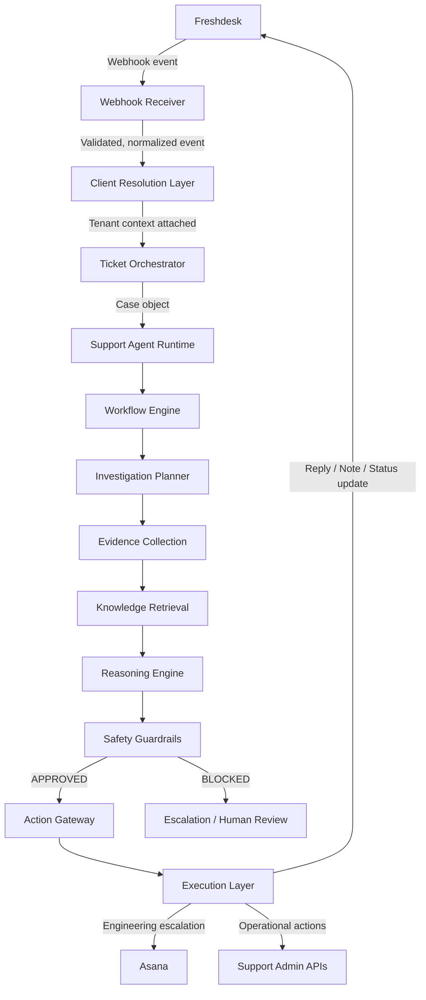
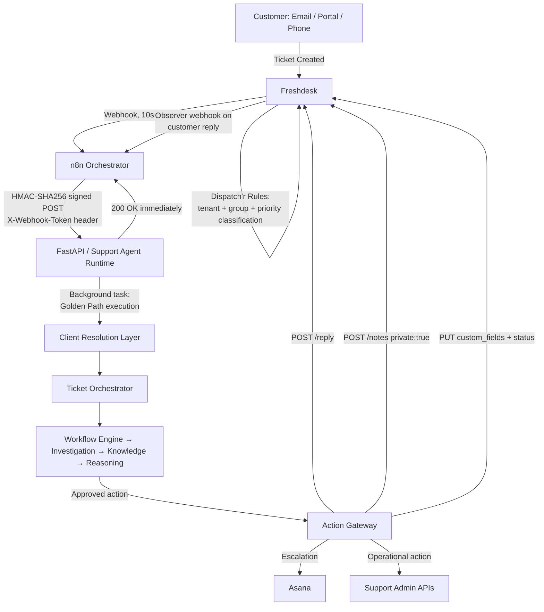
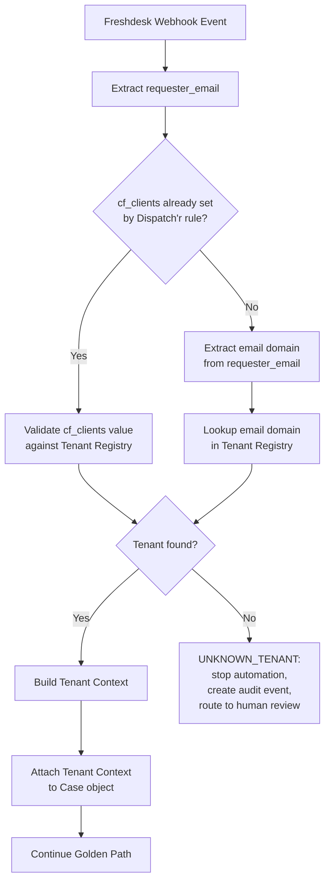
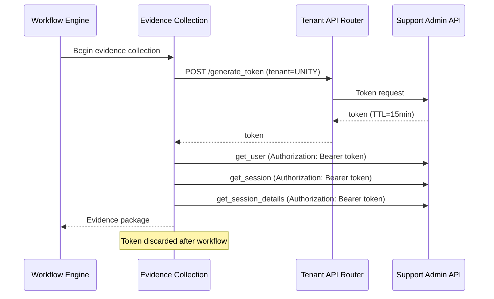
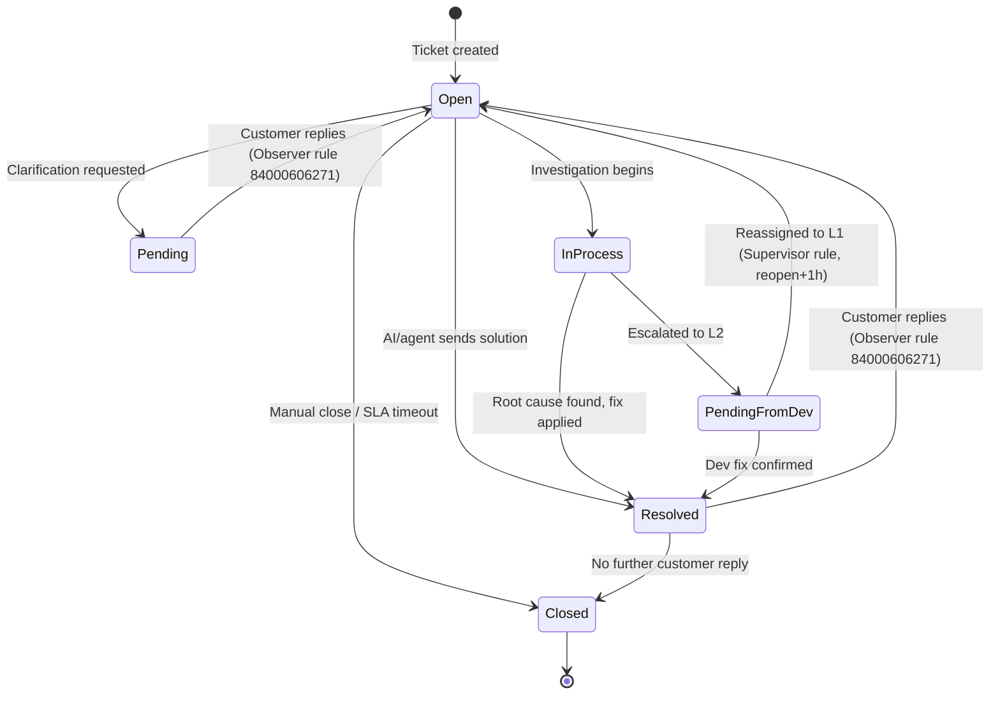
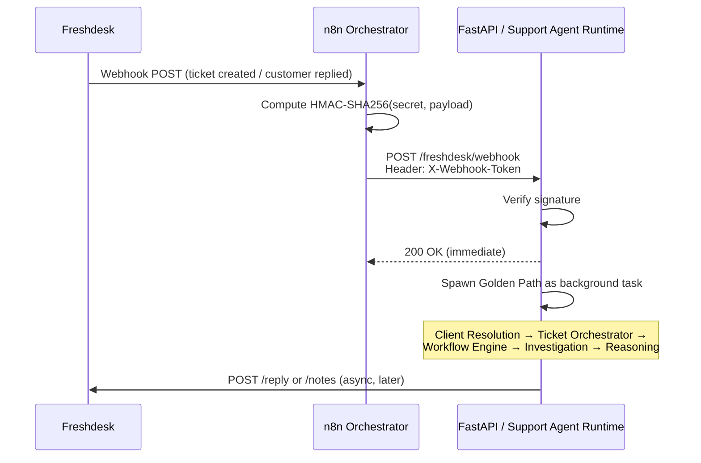
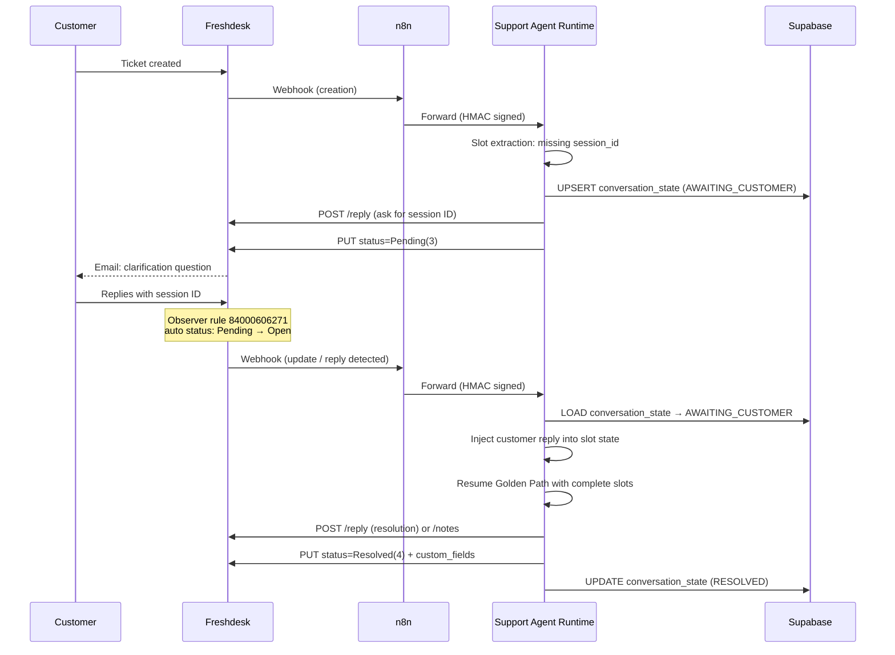
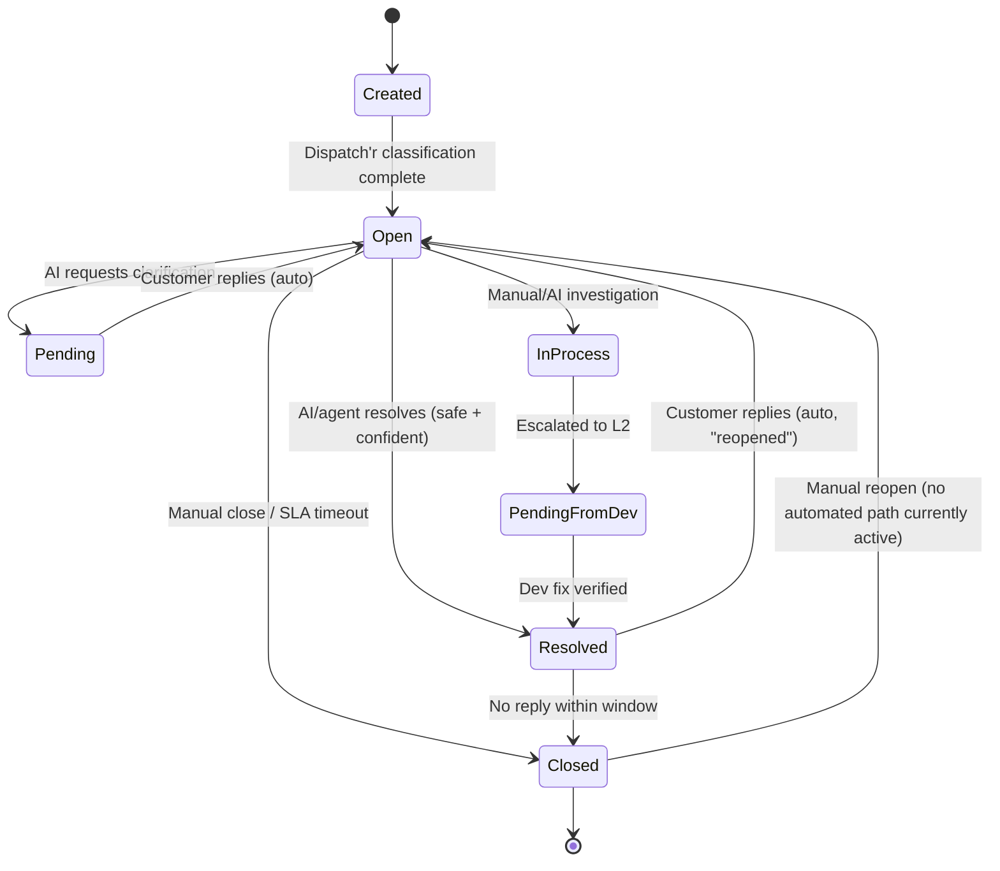

# freshdesk_integration.md — KwikID Support Agent Runtime

**Document type**: Permanent engineering reference (source of truth)
**Project**: KwikID Support Automation Platform — Support Agent Runtime
**Subsystem**: Freshdesk Customer Communication Layer + Runtime Architecture
**Applies to**: Sprint 2.28 and all subsequent work on the Support Agent Runtime
**Source material**: `SPRINT_2_28_FINAL_FRESHDESK_INTEGRATION_AUDIT.md`, `SPRINT_2_28_FRESHDESK_ARCHITECTURE_REPORT.md`, `scratch_audit_freshdesk.json` (live, read-only Freshdesk API audit), `SUPPORT_OPERATIONS_BLUEPRINT.md`
**Companion documents**: `SUPPORT_OPERATIONS_BLUEPRINT.md`, `flow_diagram.mermaid`
**Tenant scope at time of audit**: Live production Freshdesk instance, 54 active ticket fields, 5 groups, 24 agents, 30 Dispatch'r rules, 10 Observer rules, 4 Supervisor (time-trigger) rules, 4 configured webhooks.

> **Important framing**: Sprint 2.28 is a **Support Agent Runtime** project. Freshdesk is one component of that runtime — the customer communication surface — not the project itself. This document covers Freshdesk in depth, but all architectural decisions flow from the Support Agent Runtime design, not from Freshdesk's feature set.

> **Note on example data**: Every payload, ticket, and conversation example is built from the real schema discovered during the live audit (field names, IDs, types, status codes, group IDs, automation behavior). Example values that would identify a real customer (requester name, personal email, phone number) have been replaced with placeholders (`Jane Doe`, `jane.doe@unitybank.co.in`, `9XXXXXXXXX`). Internal agent names, client/tenant names, group names, and field choice lists are reproduced exactly as discovered, because they are operational facts the automation depends on.

---

## 0. Golden Path Architecture (Authoritative Runtime Flow)

> **This section defines the ONLY valid production execution path.** It was established as of Sprint 2.27.8 and must not be bypassed by any future implementation.

### 0.1 The Golden Path

Every support ticket processed by the KwikID Support Agent Runtime — regardless of tenant, issue type, or channel — must travel this exact path and no other:

```
Freshdesk
    ↓
Webhook Receiver
    ↓
Client Resolution Layer
    ↓
Ticket Orchestrator
    ↓
Support Agent Runtime
    ↓
Workflow Engine
    ↓
Investigation Planner
    ↓
Evidence Collection
    ↓
Knowledge Retrieval
    ↓
Reasoning Engine
    ↓
Safety Guardrails
    ↓
Action Gateway
    ↓
Execution Layer
    ↓
Freshdesk / Asana / Support APIs
```



### 0.2 What the Golden Path explicitly excludes

The following endpoints and utilities **are not valid support workflow entrypoints** and must never be invoked directly as the primary handler for a production support ticket:

- **Legacy RAG endpoints** — any route that calls a retrieval pipeline without first passing through the Webhook Receiver → Client Resolution → Ticket Orchestrator chain.
- **Knowledge utilities / search endpoints** — the Knowledge Layer exists to serve the Investigation Planner, not to answer customer questions directly.
- **Testing endpoints** — routes that exist for development/QA purposes and bypass the Safety Guardrails or Action Gateway.
- **Direct Freshdesk API calls from non-Execution-Layer code** — no component upstream of the Action Gateway is permitted to call Freshdesk's write endpoints (`/reply`, `/notes`, `PUT /tickets/{id}`). All writes flow through the Action Gateway → Execution Layer.

This constraint was established in Sprint 2.27.8 and is non-negotiable. Any future capability (new action type, new tenant, new investigation tool) must be **added into the Golden Path** at the appropriate layer, not wired around it.

### 0.3 Layer responsibilities summary

| Layer | Responsibility | Must not |
| :--- | :--- | :--- |
| Webhook Receiver | HMAC verification, normalization, idempotency check, return `200 OK`, enqueue background task | Block on LLM/RAG work |
| Client Resolution Layer | Resolve requester email → tenant, build Tenant Context, attach to Case | Continue if tenant is UNKNOWN |
| Ticket Orchestrator | Create/load Case object, manage lifecycle state transitions | Bypass Tenant Context |
| Support Agent Runtime | Orchestrate the full pipeline for one ticket/case | Skip Safety Guardrails |
| Workflow Engine | Select the correct playbook based on topic classification | Call external APIs |
| Investigation Planner | Determine what evidence to collect and in what order | Invent results |
| Evidence Collection | Call Support Admin APIs, retrieve session/user data | Call production write APIs |
| Knowledge Retrieval | Semantic + keyword SOP search, RRF+BM25 ranking | Replace investigation with SOP text |
| Reasoning Engine | Root cause analysis, confidence scoring, action recommendation | Execute actions |
| Safety Guardrails | Confidence threshold check, risk classification, approval routing | Approve high-risk actions without human sign-off |
| Action Gateway | Enterprise safety boundary — the ONLY path to external writes | Be bypassed |
| Execution Layer | Call Freshdesk/Asana/Support APIs with approved actions | Call without Action Gateway approval |

---

## 1. Purpose

Freshdesk is the **Customer Communication Layer** of the KwikID Support Automation Platform. It is the single, universal entry point through which every support ticket — across every tenant (Unity, BOB, CBI, RBL, BajajFin, ThomasCook, Canara Bank, FINO, Toyota, and 30+ other clients) — enters the system, and the single channel through which every customer-facing communication (reply, note, status change) leaves the system.

Freshdesk does **not** perform reasoning, retrieval, or decision-making. It is the mailbox, the ticket database, and the rules engine for routing and bookkeeping. All intelligence lives downstream in the Support Agent Runtime. Freshdesk's job in this architecture is threefold:

1. **Ingest** — receive tickets from email, portal, phone, and other channels; apply Dispatch'r rules to do first-pass tenant/group/priority classification; fire a webhook so the runtime knows a ticket exists.
2. **Hold state** — store ticket status, custom fields, conversation history, and SLA timers as the canonical record of where a ticket is in its lifecycle.
3. **Communicate** — accept API calls from the Execution Layer to post public replies, private notes, and field/status updates, and to notify the runtime (via Observer webhooks) when the customer responds.

Every section of this document after Section 0 exists to support an engineer or AI agent implementing exactly those three responsibilities correctly, without corrupting Freshdesk's existing automation, without violating its rate limits, and without breaking the human-agent workflow that already runs on top of the same instance.

---

## 2. High-Level Architecture

Freshdesk sits at both ends of the pipeline: it originates the event that wakes the runtime up, and it is the last-mile delivery mechanism for whatever the runtime decides to do.



### Core architecture components

| Component | Role |
| :--- | :--- |
| **Freshdesk** | Customer communication layer. Ticket database, rules engine, SLA clock, agent UI. |
| **n8n Orchestrator** | Entry buffer that absorbs the Freshdesk 10-second webhook timeout, computes the HMAC signature, and forwards the event to FastAPI. Target end-state for production; the "future nervous system." |
| **FastAPI / Support Agent Runtime** | Owns all reasoning. Receives the webhook, returns `200 OK` immediately, then runs the Golden Path pipeline as a background task. |
| **Client Resolution Layer** | Resolves requester email → Tenant Context. First thing that runs inside the background task after idempotency check. |
| **Ticket Orchestrator** | Creates and manages the Case object; drives state machine transitions throughout the ticket lifecycle. |
| **Knowledge Layer** | Hybrid semantic (pgvector) + keyword (FTS) retrieval over StackOverflow Teams SOP content, ranked with Reciprocal Rank Fusion (RRF) and BM25. |
| **Investigation Layer** | Calls tenant-specific Support Admin APIs via the Tool Registry to pull session/case-level operational data. |
| **Reasoning Engine** | Performs root cause analysis and runs the confidence/safety gate that decides whether an automated reply is safe to send. |
| **Action Gateway** | The single enterprise safety boundary. All external writes flow through it. |
| **Execution Layer** | Makes the actual API calls to Freshdesk, Asana, and Support Admin APIs once the Action Gateway approves. |
| **Asana** | Engineering escalation destination when a ticket requires developer action. |

---

## 3. Freshdesk Responsibilities

A hard boundary must exist between what each layer is allowed to own. This boundary is what keeps the AI agent from fighting Freshdesk's existing human-built automation.

### Freshdesk owns
- The ticket record itself: ID, status, priority, group, agent assignment, all custom field values, tags, conversation thread.
- SLA timers (`due_by`, `fr_due_by`) and their pause/resume behavior tied to status.
- Tenant-routing Dispatch'r rules that run on ticket creation (see Section 4 and Section 20).
- Observer rules that react to ticket updates (e.g. reopening on customer reply, first-responder auto-assignment).
- Supervisor (time-trigger) rules that run hourly.
- The only interface human support agents use day-to-day.

### Support Agent Runtime owns
- All reasoning: retrieval, root cause analysis, confidence scoring, safety-gate evaluation.
- The decision of *what* to write back to Freshdesk (reply text, note text, field values, status target) and *whether* it is safe to do so automatically.
- Webhook signature verification (HMAC-SHA256 over `X-Webhook-Token`).
- Tenant context (resolved by the Client Resolution Layer, not re-derived per-call).
- Its own state store (Supabase) for anything Freshdesk cannot natively represent, most notably clarification conversation state (Section 16).
- Rate-limit budgeting against the Freshdesk account-wide ceiling (Section 14.5 / Section 24).

### n8n owns (target end-state; not yet fully built)
- Buffering the Freshdesk webhook so FastAPI never has to respond within Freshdesk's 10-second window directly.
- HMAC signature generation for outbound calls to FastAPI.
- Any batching, filtering, or future multi-step orchestration logic that should not live inside FastAPI request handlers.

### Explicitly NOT Freshdesk's job
- Freshdesk has no concept of "draft" replies, no LLM, and no knowledge of SOP content. Any feature that sounds like "let the AI draft inside Freshdesk and a human approves" must be built as a **private note**, because the REST API has no draft object (see Section 18).

---

## 4. Tenant Resolution Architecture

Tenant resolution is a **first-class runtime architectural component**, not just a Freshdesk configuration detail. The Support Agent Runtime is multi-tenant: every investigation, every tool call, every action must execute within an isolated Tenant Context that identifies which client's environment is being operated on.

### 4.1 Tenant resolution as a runtime flow



**Rule**: Automation must never continue with an unresolved tenant. If `ClientResolver` returns `UNKNOWN_TENANT`, the pipeline stops at that point, an audit event is created, and the ticket is routed to human review.

### 4.2 ClientResolver component

The `ClientResolver` component (part of the Client Resolution Layer in the Golden Path) implements the following resolution priority order:

1. **`cf_clients` field** (set by Freshdesk Dispatch'r rules) — the primary signal. If already set and recognized, no further resolution is needed.
2. **Requester email domain** — e.g. `unitybank.co.in` → `UNITY`, `bankofbaroda.com` → `BOB`, `bajajfinserv.in` → `BAJAJ_FIN`, `rblbank.com` → `RBL`, `finobank.com` → `FINO`, `tfsin.co.in` → `TOYOTA`, `centralbank` → `CBI`, `thomascook.in` → `THOMAS_COOK`, `grihumhousing.com` → `GHF`, `canarabank.com` → `CANARA`.
3. **CC email domains** — same matching logic, applied to `cc_emails`.
4. **Subject-line keywords** — last-resort fallback only; collision-prone and should not be relied on for new tenant onboarding.

### 4.3 Tenant Context object

Once resolved, the Tenant Context is built and attached to the Case for the duration of the workflow:

```
TenantContext
├── tenant_id            (e.g. "UNITY", "BOB", "RBL")
├── tenant_name          (e.g. "Unity Bank", "Bank of Baroda")
├── portal_configuration (base URL, portal type, supported workflows)
├── api_credentials_ref  (reference to secrets store — never the credentials themselves)
├── enabled_tools        (list of Tool Registry tool IDs available for this tenant)
└── workflow_overrides   (tenant-specific playbook overrides, if any)
```

### 4.4 Tenant API Router

The Tenant API Router is the single component responsible for resolving all tenant-specific integrations.

Inputs:
- tenant_id
- tenant_context

Outputs:
- base_url
- authentication strategy
- API credentials
- Tool Registry bindings

Example:

Unity
→ Unity API base URL
→ Unity JWT generation
→ Unity Tool Registry

BOB
→ BOB API base URL
→ BOB JWT generation
→ BOB Tool Registry

Rules:

1. No tool may directly select credentials.
2. All tenant-specific calls flow through Tenant API Router.
3. Cross-tenant calls are prohibited.
4. Tool Registry receives only TenantContext.
5. Authentication tokens are generated per workflow execution.

### 4.5 Tenant-scoped execution

All Support Admin API calls are routed through the **Tenant API Router**. Direct access to client portals from any layer other than the Execution Layer is prohibited. This guarantees client isolation, credential isolation, and safe onboarding of new clients.

### 4.6 Current vs. future tenant rollout

**Sprint 2.28 production scope: Unity only** (`*@unitybank.co.in`).

Future tenants (to be added in subsequent sprints):

| Tenant ID | Client Name | Email Domain(s) |
| :--- | :--- | :--- |
| `UNITY` | Unity Bank | `unitybank.co.in` |
| `BOB` | Bank of Baroda | `bankofbaroda.com` |
| `CBI` | Central Bank of India | `centralbank.co.in`, `centralbank` |
| `RBL` | RBL Bank | `rblbank.com` |
| `BAJAJ_FIN` | BajajFin | `bajajfinserv.in` |
| `THOMAS_COOK` | Thomas Cook | `thomascook.in` |
| `CANARA` | Canara Bank | `canarabank.com` |
| `FINO` | FINO Payments Bank | `finobank.com` |
| `TOYOTA` | Toyota Financial | `tfsin.co.in` |
| *(additional)* | *(see cf_clients full list, Section 9.1)* | — |

### 4.7 How Freshdesk Dispatch'r rules participate in tenant resolution

Freshdesk Dispatch'r rules set `cf_clients` before the AI runtime ever sees a ticket, effectively doing Freshdesk-layer pre-resolution:

1. **Requester / CC email domain** — the primary rule trigger for all named-client rules.
2. **Company Name field** — e.g. `"BankOfBaroda"` triggers the BOB rule even without a matching email domain.
3. **Subject-line keyword matching** — used as a fallback by some rules (e.g. subject containing `"unity"`, `"RBL"`, `"CBI"`, `"FINO"`, `"TOYOTA"`, `"BOB"` / `"bank of baroda"`).
4. **Explicit fallback `"Others"`** — the **"AI auto replies"** Dispatch'r rule targets `Clients is "Others"` plus two internal test requesters.

The AI system treats `cf_clients` as **read-only** — it does not overwrite a value Freshdesk has already set. If `cf_clients` is missing or `"Others"`, the `ClientResolver` uses email domain as its own resolution signal.

### 4.8 Tags as a secondary routing signal

| Tag | Set by | Meaning |
| :--- | :--- | :--- |
| `auto_assigned_client` | Most per-client Dispatch'r rules | A named-client rule matched and set `cf_clients`. |
| `auto_client_assign_as_unity` | "Assign tickets to Unity" | Unity-specific confirmation tag. |
| `auto_assigned_group` | "AI auto replies" rule | Ticket was routed to L1 and flagged for AI handling. |
| `ai_auto_replied` | "AI auto replies" rule | Ticket is in-scope for the AI/n8n webhook pipeline. |
| `btb` | "Assign tickets to Thomas Cook" | Business-to-business client marker. |
| `alert` | "RBL alerts" | System/infrastructure alert ticket — not actionable by AI. |
| `daily-report` / `mtd` / `report` | RBL reporting rules | Scheduled report email, auto-closed. |
| `Reopened` | "Re-Assign Ticket From L2 to L1" Supervisor rule | Ticket bounced back to L1 after client reopened it. |
| `new_ticket_webhook` | Inactive Observer rule `84000606273` | Reserved tag for a disabled flow. |

The Webhook Receiver should treat `tags` as a cheap pre-filter: skip the reasoning pipeline entirely if `alert`, `daily-report`, or `mtd` is present.

---

## 5. Tool Registry Architecture

The Tool Registry is the **authoritative catalog of all operational capabilities** available to the Support Agent Runtime. Every action the runtime can perform — whether read or write — is registered as a Tool. Tools are tenant-scoped, permission-scoped, audit-logged, and safety-gated.

This architecture exists because the system is no longer `ticket → answer`. It is `ticket → reason → decide → act`. The list of possible actions is growing (crop_video is the most recent example), and every new action must be registered here before it can be invoked.

### 5.1 Read Tools

Read tools are safe by definition — they retrieve data but do not modify production state. They bypass the Action Gateway's approval workflow but are still audit-logged.

| Tool ID | Function | Inputs | Output | Tenant Availability |
| :--- | :--- | :--- | :--- | :--- |
| `get_user` | Look up a user profile by URN or phone number | `urn` or `phone_number`, `tenant_context` | User profile object | Unity (Phase 2+); others on rollout |
| `get_session` | Retrieve a VKYC session by session ID | `session_id`, `tenant_context` | Session details, status, summary | Unity (Phase 2+) |
| `get_session_details` | Retrieve full session evidence: logs, audit trail, summary | `session_id`, `tenant_context` | Logs array, summary object, audit events | Unity (Phase 2+) |
| `search_sessions_by_urn` | Find sessions associated with a URN | `urn`, `date_hint`, `tenant_context` | Session list with confidence scoring | Unity (Phase 2+) |
| `get_session_video` | Retrieve video recording reference (future capability) | `session_id`, `tenant_context` | Video URL / reference | Future |
| `get_sop` | Retrieve SOP document from Knowledge Layer | `query`, `topic`, `tenant_context` | Ranked SOP matches with confidence scores | All tenants |

### 5.2 Write Tools

Write tools modify production state. Every write tool must pass through the Action Gateway. Risk level determines whether execution is automatic, threshold-gated, or approval-required (see Section 23).

| Tool ID | Function | Inputs | Risk Level | Tenant Availability |
| :--- | :--- | :--- | :--- | :--- |
| `post_internal_note` | Post a private note to Freshdesk | `ticket_id`, `body` | SAFE | All tenants |
| `post_customer_reply` | Send a public reply to the customer | `ticket_id`, `body`, `cc_emails` | MEDIUM | All tenants |
| `update_ticket_fields` | Update custom fields and status | `ticket_id`, `fields` | MEDIUM | All tenants |
| `create_asana_task` | Create an engineering escalation task | `title`, `description`, `evidence` | MEDIUM | All tenants |
| `resend_otp` | Trigger an OTP resend via Support Admin API | `session_id`, `tenant_context` | SAFE | Unity (Phase 2+) |
| `retry_ocr` | Retry an OCR operation | `session_id`, `tenant_context` | SAFE | Unity (Phase 2+) |
| `reset_session` | Reset a VKYC session to a prior stage | `session_id`, `target_stage`, `tenant_context` | REVERSIBLE | Unity (Phase 2+) |
| `crop_video` | Crop/trim a VKYC session recording | `session_id`, `start_ts`, `end_ts`, `tenant_context` | HIGH | Unity (Phase 2+) |
| `pan_correction` | Correct PAN data for a user record | `session_id`, `pan_data`, `tenant_context` | CRITICAL | Future |
| `user_creation` | Create a new user in the Support Admin Portal | `user_data`, `tenant_context` | CRITICAL | Future |
| `manual_repush` | Manually push a session result | `session_id`, `tenant_context` | HIGH | Unity (Phase 2+) |

### 5.3 Tool Registry rules

1. **No tool may be called outside the Execution Layer.** Investigation Planner, Evidence Collection, and all layers above the Action Gateway call tool *descriptors*, not the tools themselves. The Execution Layer is the only place that makes real API calls.
2. **Tenant scoping is mandatory.** Every tool call carries a `tenant_context`. The Tenant API Router uses this to select the correct credentials and base URL. There are no cross-tenant calls.
3. **Every tool invocation is audit-logged** with: timestamp, ticket_id, tenant_id, tool_id, inputs (with PII redacted), output summary, agent identity, Action Gateway decision.
4. **New tools must be registered here before implementation.** Adding a new capability without registering it in the Tool Registry and assigning it a risk level (Section 23) violates the Golden Path constraint.

### 5.4 Tool Registry Extensibility

All new operational capabilities must be implemented as Tool Registry tools.

Examples:

- get_user
- get_session
- get_details
- crop_video
- resend_otp
- retry_ocr
- pan_correction
- user_creation

No workflow logic may directly call external APIs.

All execution must flow through:

Workflow Engine
→ Action Gateway
→ Tool Registry
→ Tenant API Router
→ External API

---

## 6. Integration Rollout Strategy

The Support Agent Runtime is being deployed in phases. Each phase represents a stable, independently deployable increment. Future implementation must align with the current phase and not leapfrog ahead.

### Phase 1 — Backend Only (Current: Sprint 2.28)

```
Freshdesk
    ↓
FastAPI (Support Agent Runtime)
```

Capabilities live in this phase:
- Webhook reception and HMAC verification
- Client resolution (Unity only)
- Ticket orchestration and Case lifecycle
- Knowledge retrieval (StackOverflow SOPs)
- Reasoning and safety gate
- Freshdesk writes: notes, replies, field/status updates
- Asana escalation (basic task creation)

**Not yet live**: Unity Admin APIs (investigation tools are simulated or SOP-only), n8n orchestration.

---

### Phase 2 — Backend + Unity Admin APIs

```
Freshdesk
    ↓
FastAPI
    ↓
Unity Admin APIs (via Tool Registry)
```

Capabilities added:
- `get_user`, `get_session`, `get_session_details` (real data)
- `search_sessions_by_urn`
- `resend_otp`, `retry_ocr` (safe write tools, auto-executable)
- Full investigation pipeline with real evidence
- Token generation per workflow execution (Section 7)

---

### Phase 3 — Backend + Asana (Full Escalation Loop)

```
Freshdesk
    ↓
FastAPI
    ↓
Asana (full L2 escalation package)
```

Capabilities added:
- Full L2 escalation package (root cause, evidence, logs, session details, reproduction steps) written to Asana
- Asana task linked back to Freshdesk via `cf_asana_ticket_link`
- Resolution loop: dev fix in Asana triggers `cf_resolved_date_by_developer` update in Freshdesk

---

### Phase 4 — Backend + n8n Orchestration

```
Freshdesk
    ↓
n8n
    ↓
FastAPI
```

Capabilities added:
- n8n acts as the full webhook buffer (absorbs Freshdesk's 10-second timeout)
- HMAC signature generation moves to n8n
- n8n handles event filtering, batching, and rate control before forwarding to FastAPI
- Multi-tenant webhook routing via n8n workflow logic

---

### Phase 5 — Support Operations UI

```
Support Dashboard
    ↓
FastAPI
    ↓ ↓ ↓ ↓ ↓
n8n  Freshdesk  Admin APIs  Asana  Reporting
```

Capabilities added:
- Internal dashboard for support managers to view AI decisions, override, and approve high-risk actions
- Approval workflow UI for `HIGH` and `CRITICAL` Tool Registry items (Section 23)
- Human-in-the-loop review queue for low-confidence tickets
- Observability: per-ticket Golden Path trace, confidence scores, tool execution logs

---

## 7. Support Admin API Strategy

Every time the Support Agent Runtime needs to call a Support Admin API tool (read or write), it must first obtain a fresh authentication token. This section defines the token strategy for Sprint 2.28 and beyond.

### 7.1 Token generation

```
POST /generate_token
```

- **When**: Before every workflow execution that requires Support Admin API calls. A token is generated at the start of the Evidence Collection phase and used for all tool calls within that single workflow run.
- **TTL**: Approximately 15 minutes. Tokens are short-lived by design.
- **Sprint 2.28 rule**: **No token caching.** Generate a fresh token per workflow execution, every time. This was explicitly specified by the CTO for the initial rollout. Do not implement a token cache in Sprint 2.28 even if it seems like an optimization.
- **Token scope**: Tenant-scoped. A token generated for a Unity workflow is not usable for a BOB tool call.

### 7.2 Token lifecycle within a workflow



### 7.3 Token failure handling

- If token generation fails, the workflow must **stop at the Evidence Collection phase**, create an internal Freshdesk note explaining that investigation could not be completed, and route the ticket to human review. It must not proceed to the Reasoning Engine with incomplete evidence.
- Token expiry mid-workflow (TTL exceeded during a long investigation) should be handled by re-generating a token and retrying the failed tool call once before declaring failure.

---

## 8. Ticket Object Model

A Freshdesk ticket is one JSON object combining standard (default) fields and custom (`cf_*`) fields. The schema below is reproduced field-for-field from the live audit (54 total fields).

### 8.1 Standard ticket fields

| API Name | Field ID | Type | Required for Closure | Required for Agents | Notes |
| :--- | :--- | :--- | :---: | :---: | :--- |
| `id` | — | Integer (read-only) | — | — | Ticket number, e.g. `197416`. |
| `subject` | `84000216715` | String | False | True | Customer-visible summary. |
| `description` / `description_text` | `84000216723` | HTML / plain text | False | True | Full body; `description` is HTML, `description_text` is the stripped plain-text form used for parsing/regex extraction. |
| `requester` (`requester_id`) | `84000216714` | Object/Integer | False | True | Has `id`, `name`, `email`, `mobile`, `phone`. |
| `status` | `84000216718` | Integer | True | True | See Section 11. |
| `priority` | `84000216719` | Integer | True | True | See Section 12. |
| `group` (`group_id`) | `84000216720` | Integer | True | True | See Section 10. |
| `agent` (`responder_id`) | `84000216721` | Integer | False | False | Assigned human/AI agent. |
| `ticket_type` (`type`) | `84000216716` | String | True | False | See Section 13. |
| `source` | `84000216717` | Integer | False | False | Channel; see table in Section 14.5. |
| `company` (`company_id`) | `84000216724` | Integer | False | True | Maps the requester's organization to a Freshdesk Company record. |
| `source_info` | `84000734318` | Object | False | False | Channel-specific metadata (e.g. originating mailbox). |
| `tags` | — | Array of strings | — | — | Free-form, automation-managed. |
| `attachments` | — | Array of objects | — | — | File attachments on the ticket. |
| `cc_emails` / `ticket_cc_emails` / `reply_cc_emails` / `ticket_bcc_emails` | — | Array of strings | — | — | CC/BCC lists; `cc_emails` is the full live CC set, `ticket_cc_emails` excludes internal addresses already covered by routing. |
| `fr_escalated` / `is_escalated` | — | Boolean | — | — | Whether SLA breach escalation has fired. |
| `due_by` / `fr_due_by` | — | ISO 8601 datetime | — | — | Resolution SLA deadline / first-response SLA deadline. |
| `stats` | — | Object | — | — | `agent_responded_at`, `first_responded_at`, `status_updated_at`, `resolved_at`, `closed_at`, `reopened_at`, `pending_since`. |

### 8.2 Example ticket object (sanitized)

```json
{
  "id": 197416,
  "subject": "Not visible in Auditor view",
  "description": "<div>Hi Team,<br>The record is not visible in the Auditor view for mobile number 9XXXXXXXXX.<br>Session ID: F70a8888-96ee-45bb-b777-6942c2cd8ce3.<br><br>Regards,<br>Jane Doe</div>",
  "description_text": "Hi Team, \n\nThe record is not visible in the Auditor view for mobile number 9XXXXXXXXX. \nSession ID: F70a8888-96ee-45bb-b777-6942c2cd8ce3. \n\nRegards, \nJane Doe",
  "status": 5,
  "priority": 3,
  "type": "Issues",
  "source": 1,
  "group_id": 84000293343,
  "responder_id": 84054016729,
  "company_id": 84000786048,
  "requester": {
    "id": 84084194436,
    "name": "Jane Doe",
    "email": "jane.doe@unitybank.co.in",
    "mobile": null,
    "phone": null
  },
  "created_at": "2026-06-18T08:06:12Z",
  "updated_at": "2026-06-18T09:56:29Z",
  "due_by": "2026-06-18T12:06:12Z",
  "fr_due_by": "2026-06-18T09:06:12Z",
  "fr_escalated": true,
  "is_escalated": false,
  "tags": ["auto_assigned_client", "auto_client_assign_as_unity"],
  "custom_fields": {
    "cf_clients": "Unity",
    "cf_session_ids": "F70a8888-96ee-45bb-b777-6942c2cd8ce3",
    "cf_environment": "Production",
    "cf_issue_area": "Frontend",
    "cf_portal": "Admin",
    "cf_query_type": "Video Related",
    "cf_impact": "Medium Impact",
    "cf_issue_type234462": "Recurring issue",
    "cf_sop_status": "SOP Present",
    "cf_resolution_classification": "Solved by SOP (Temporary Workaround)",
    "cf_rca_status": "No RCA Needed",
    "cf_handling_time": "20",
    "cf_stackoverflow_link": "https://stackoverflowteams.com/c/kwikid/questions/514",
    "cf_review_ticket": "No"
  },
  "stats": {
    "agent_responded_at": "2026-06-18T09:56:10Z",
    "first_responded_at": "2026-06-18T09:56:10Z",
    "status_updated_at": "2026-06-18T09:56:16Z",
    "resolved_at": "2026-06-18T09:56:16Z",
    "closed_at": "2026-06-18T09:56:16Z",
    "reopened_at": null,
    "pending_since": null
  }
}
```

### 8.3 Custom field update payload shape

Custom fields are **always** nested under a `custom_fields` object when written via `PUT /api/v2/tickets/{id}`. They appear flattened at the top level of `ticket_custom_fields` only inside webhook payloads (Section 15), never in direct API writes:

```json
{
  "custom_fields": {
    "cf_clients": "Unity",
    "cf_sop_status": "SOP Present",
    "cf_resolution_classification": "Solved by SOP (Temporary Workaround)"
  }
}
```

---

## 9. Custom Fields Reference

There are **43 custom (`cf_*`) fields** in the live instance, organized below by functional domain. For each field: internal API name, Freshdesk field ID, type, whether it's required to close a ticket / required for agents, its purpose, and the AI's control scope.

### 9.1 Tenant identification

| Field | ID | Type | Req. Closure | Req. Agents | Purpose | AI Control Scope |
| :--- | :--- | :--- | :---: | :---: | :--- | :--- |
| `cf_clients` | `84000732906` | Dropdown (42 values) | True | True | Identifies which of the 42 client/tenant organizations the ticket belongs to. | **Read-only.** Set by Dispatch'r rules. AI uses this as its tenant resolution input; does not overwrite. |
| `cf_clients_email_id` | `84000734112` | Text | False | False | Free-text capture of a specific client contact email. | Read-only / informational. |

**`cf_clients` full value list**: `Others`, `CBI`, `Unity`, `Canara Bank`, `CAMS SBIG`, `BajajFin`, `RBL`, `BOB`, `ABFL`, `RupeeRedee`, `TATA`, `CAMS OICL`, `ThomasCook`, `NRFSI`, `Kerala GB (Canara RRB)`, `Shinhan Bank`, `BOB RRB`, `Karnataka GB (Canara RRB)`, `CBI RRB`, `Grihum Housing Finance (PHF)`, `BHF`, `Spark Capital`, `Easebuzz`, `FINO`, `Upwards`, `Opdyta`, `Zelthy`, `TATA 1MG`, `Sarvagram`, `Pfizer`, `Toyota`, `ICICI`, `Iverify`, `TVS Credit`, `CAGL`, `MOHFL`, `EpayLater`, `FlyHi`, `Svamaan`, `BOB cards`, `Saas`, `CAMSRep`.

### 9.2 Issue classification / diagnostics

| Field | ID | Type | Req. Closure | Req. Agents | Purpose | AI Control Scope |
| :--- | :--- | :--- | :---: | :---: | :--- | :--- |
| `cf_query_type` | `84000731549` | Dropdown (67 values) | True | True | Fine-grained issue category (e.g. "Video Recovery", "API Issues", "Session Not Available"). Drives reporting and SOP matching. | **Write.** AI classifies from ticket body / RAG match category. |
| `cf_issue_area` | `84000731609` | Dropdown (10 values: Frontend, Backend, Database, API, UI/UX, DevOps/infrastructure/deployments, Security-related, Network/firewall, Third-party Integrations, Other) | True | True | High-level technical surface the issue belongs to. | **Write.** AI classifies from RCA/logs. |
| `cf_portal` | `84000731618` | Dropdown (10 values: Agent, Admin, Auditor, User, Agentless, Server, SaaS, Other, Maker, Checker) | True | True | Which KwikID portal/role the customer was using when the issue occurred. | **Write.** AI infers from description. |
| `cf_environment` | `84000731552` | Dropdown (Production, UAT, CUG, Other) | True | False | Deployment environment the issue occurred in. | **Read-only.** Set at creation; AI should not change a customer-reported environment. |
| `cf_impact` | `84000731591` | Dropdown (Customer/Device specific, Low Impact, Medium Impact, High Impact, DOWNTIME 100% impact, Client Escalation) | True | True | Business severity classification. | **Write** (with caution) — `DOWNTIME` / `Client Escalation` values should trigger human review rather than be auto-assigned. |
| `cf_issue_type234462` (label: "Issue Recurrence") | `84000733127` | Dropdown (Recurring issue, New/One-time issue) | False | False | Whether this is a known recurring problem or a first occurrence. | **Write.** AI sets based on SOP match (a Knowledge Layer hit implies "Recurring"). |
| `cf_session_ids` | `84000733126` | Paragraph | True | False | One or more VKYC session identifiers (UUID-like strings). | **Read/Write.** AI extracts via regex from `description_text`; required before a ticket can be closed. |

**`cf_query_type` full value list (67)**: Server Alert, Video Recovery, Connectivity Issue, Reports, Video Related, Audio Related, ID Creation, Manual Repush, Portal Not Working, User Form Issue, Document Required, Logs Required, Esign Related, Unable to Login, Call Connected to Multiple Agents, Call not getting connected, API Issues, Ekyc Data Missing, CKYC Related Issue, Session Not Available, Unable to Book Slots, Back to Branch, Test Mail, Call Test, Failed To Capture Image, Case Not Visible In Agent/Admin, Manual API Trigger, Production Deployment, UAT Deployment, Account Creation, ID Mapping Change, ID De-duplication, Send Link Issue, Audit Lock, Auditor Hold, NSDL/PAN Related, Aadhaar Masking, VAPT, Patching Activity, IP Missing, Agentless Session Issue, RCA, Meeting, CIF_Related, CBS Related, BRANCH_MASTER UPDATE, CR, DC-DR, Product Code Missing, Live Tab Not Working, Error While Submitting Result, Sessions Tab Not Working, SUMMARY_DATA_UPDATE [LAT_LONG_MISSING], SUMMARY_DATA_UPDATE [USER_IP_MISSING], SUMMARY_DATA_UPDATE [IMAGE_MISSING], SUMMARY_DATA_UPDATE (OTHERS), SUMMARY_DATA MISSING OR NOT AVAILABLE, Production Down, Production Scheduled Downtime, UAT Related Issues, Non support related (internal), Manual callback trigger, Manual session status update, Stage Data Reset, TOKEN GENERATION, FUND TRANSFER, Others.

### 9.3 SOP / Knowledge Layer fields

| Field | ID | Type | Req. Closure | Req. Agents | Purpose | AI Control Scope |
| :--- | :--- | :--- | :---: | :---: | :--- | :--- |
| `cf_sop_status` | `84000733981` | Dropdown (SOP Present, SOP Created (New), Old SOP Modified, No SOP Available, No SOP Required) | False | True | Records whether a Standard Operating Procedure existed and was used. | **Write.** AI sets based on Knowledge Layer retrieval confidence. |
| `cf_stackoverflow_link` | `84000733975` | Text | False | False | Direct URL to the internal StackOverflow Teams question/answer used. | **Write.** AI populates with the retrieved SOP source link. |
| `cf_resolution_classification` | `84000733982` | Dropdown (Solved by SOP (Permanent Fix), Solved by SOP (Temporary Workaround), Temporary Fix Applied by Dev (Pending Permanent), Permanent Fix Applied by Dev, No SOP Issue Exists (No support action required), Wrongly reported by client Not an Issue (No actions taken)) | False | False | Final classification of how the ticket was solved. | **Write.** AI sets on auto-resolution. |
| `cf_rca` | `84000732701` | Paragraph | False | False | Free-text Root Cause Analysis. | **Write.** AI populates on automated resolutions. |
| `cf_rca_status` | `84000733980` | Dropdown (RCA Shared, RCA Pending from dev, No RCA Needed) | False | True | Tracks whether an RCA has been communicated. | **Write.** AI updates to "RCA Shared" once the RCA note/reply is sent. |
| `cf_resolved_date_by_developer` | `84000731699` | Date | False | False | Date an engineering fix shipped. | **Write** by Execution Layer when closing the loop on an Asana-escalated fix. |
| `cf_handling_time` | `84000733621` | Paragraph (numeric, minutes) | False | True | Self-reported handling duration in minutes. | **Write.** AI records its own processing time. |

### 9.4 Escalation fields

| Field | ID | Type | Purpose | AI Control Scope |
| :--- | :--- | :--- | :--- | :--- |
| `cf_asana_ticket_link` | `84000731676` | Paragraph | URL to the Asana task created for engineering escalation. | **Write.** Populated by Execution Layer at escalation. |
| `cf_bajajfin_azure_ticket_id` | `84000733198` | Text | BajajFin-specific cross-reference to Azure DevOps ticket. | Tenant-specific; not generally applicable. |

### 9.5 QA / review fields

| Field | ID | Type | Purpose | AI Control Scope |
| :--- | :--- | :--- | :--- | :--- |
| `cf_review_ticket` | `84000734274` | Dropdown (No, Yes) | Flags a ticket for human QA review. | **Write** — AI flags its own low-confidence resolutions. |
| `cf_qa_status` | `84000732324` | Dropdown (Not Reviewed, Exceptional, Passed, Minor Improvements Needed, Major Improvements Needed - Fatal) | QA outcome. | Read-only — human QA process. |
| `cf_qa_reviewer` | `84000732325` | Dropdown (currently: "Pintu Bhattacharya") | Identifies the QA reviewer. | Read-only. |
| `cf_qa_review_date` | `84000732326` | Date | When QA review occurred. | Read-only. |
| `cf_qa_score` | `84000732327` | Dropdown (90-100, 70-89, 50-69, 0-49) | Numeric-band QA score. | Read-only. |
| `cf_qa_review_results` | `84000732328` | Paragraph | Free-text QA notes. | Read-only. |

### 9.6 Change Request (CR) / Business Analyst fields

These fields belong to the BA workflow and are out of scope for the AI support-resolution path. The AI must not populate them; if a ticket is classified as a Custom Change Request, the correct action is to route it toward the Business Analyst group.

| Field | ID | Type | Req. Closure | Req. Agents |
| :--- | :--- | :--- | :---: | :---: |
| `cf_cr_status` | `84000732913` | Dropdown (Pending approval, Approved by BA TL, Rejected by BA TL, Approved by reviewer, Rejected by reviewer) | True | True |
| `cf_current_state_of_cr` | `84000732900` | Dropdown (Requirement gathering phase, Man days efforts approved by client, Under development/Development initiated, UAT delivered, UAT pending approval/signoff, PROD pending deployment, PROD Go Live) | True | True |
| `cf_agreed_upon_per_man_day_cost_for_this_client_as_per_agreement` | `84000732901` | Number | True | True |
| `cf_efforts_in_man_days_input_only_numbers_eg_5_if_not_decided_yet_keep_it_empty` | `84000732902` | Number | True | True |
| `cf_onedrive_link_for_brd_business_requirement_document` | `84000732903` | Text | True | True |
| `cf_date_of_the_initial_clients_mail_with_the_final_requirement` | `84000732904` | Date | True | True |
| `cf_onedrive_link_for_upload_mail_screenshot_initial_clients_mail_with_the_final_requirement` | `84000732905` | Text | True | True |
| `cf_line_item_type` | `84000733079` | Dropdown (Escalation, BAU (Tracker), Bug Fix/Feature Sanity Testing, Complaince, Production Movement, BAU (Config Update), New Feature (CR) Discussion, New Prospect Discussion, Invoice follow up, Others) | False | False |

### 9.7 Periodic client-feedback fields (not AI-actionable)

| Field | ID | Type |
| :--- | :--- | :--- |
| `cf_ba_efficiency` | `84000734113` | Dropdown (Excellent, Good, Average, Poor, Terrible) |
| `cf_support_team_efficiency` | `84000734114` | Dropdown (Excellent, Good, Average, Poor, Terrible) |
| `cf_product_performance_video_kyc_platform` | `84000734115` | Dropdown (Excellent, Good, Average, Poor, Terrible) |
| `cf_delivery_efficiency` | `84000734116` | Dropdown (Excellent, Good, Average, Poor, Terrible) |
| `cf_challenges_encountered_while_using_our_product_in_this_week` | `84000734117` | Paragraph |

### 9.8 Field Service Management (FSM) fields (not AI-actionable)

| Field | ID | Type |
| :--- | :--- | :--- |
| `cf_fsm_contact_name` | `84000731543` | Text |
| `cf_fsm_phone_number` | `84000731544` | Text |
| `cf_fsm_service_location` | `84000731545` | Text |
| `cf_fsm_appointment_start_time` | `84000731546` | Date/Time |
| `cf_fsm_appointment_end_time` | `84000731547` | Date/Time |
| `cf_fsm_customer_signature` | `84000731548` | File |

These belong to Freshdesk's Field Service Management module and are not exercised by the KwikID support workflow. Leave them untouched in all AI write paths.

---

## 10. Groups Reference

There are **5 active support groups**.

| Group | ID | Description (live) | Responsibilities | Escalation Path |
| :--- | :--- | :--- | :--- | :--- |
| **L1** | `84000293343` | "Queries which are Pending from Support" | Frontline triage; first landing zone for nearly all per-client Dispatch'r rules. | Escalates to L2 or Tech Assign when investigation requires code/DB access. |
| **L2** | `84000293342` | "Queries which are Pending at Developer END" | Engineering-level investigation: DB queries, code-level bugs. | Supervisor rule re-assigns to L1 after client reopens + 1h. |
| **Tech Assign** | `84000293351` | (no description set) | Platform/development escalation target. | "Tech Assign - Notification" Dispatch'r rule fires on entry. |
| **Business Analyst** | `84000294040` | (no description set) | Requirements clarification, Custom Change Requests. | Routed directly from "BA assignment rule." |
| **General** | `84000293360` | "Alerts" | Generic system notifications, scheduled reports. `escalate_to`: Sumati Nadar. `unassigned_for`: 1h. | Auto-escalates to Sumati Nadar if unassigned for 1 hour. |

**Operational note**: The AI's webhook intake should generally only act on tickets in **L1**. Tickets already in L2, Tech Assign, or Business Analyst have been escalated past the point the AI is expected to resolve automatically. A write to a ticket in one of those groups should be note-only unless the architecture is explicitly extended to cover that group.

---

## 11. Status Model

There are **11 status values** live in the instance.

| Label | ID | Freshdesk Display Text | Workflow Meaning | SLA Clock |
| :--- | :---: | :--- | :--- | :--- |
| **Open** | `2` | "Being Processed" | Active, awaiting triage or a new response. | Running |
| **Pending** | `3` | "Awaiting your Reply" | Blocked waiting on the customer. | Paused |
| **Resolved** | `4` | "This ticket has been Resolved" | Solution sent; customer can reopen by replying. | Paused |
| **Closed** | `5` | "This ticket has been Closed" | Permanently locked. | Not applicable |
| **Pending from Development Team** | `6` | — | Escalated to L2 engineering, awaiting dev action. | Paused |
| **Pending from Client** | `7` | — | Waiting on the enterprise client/partner. | Paused |
| **Pending from L1** | `8` | — | Assigned to frontline team for a check. | Paused |
| **Pending from L2** | `9` | — | Waiting on a developer response. | Paused |
| **In Process** | `10` | — | Active investigation underway. | Running |
| **Pending from support** | `11` | — | Internal L1 review in progress. | Paused |
| **Hold** | `12` | — | Parked; not actively worked. | Paused |

### 11.1 Allowed / expected transitions



### 11.2 Workflow implications for the AI

- **Reopen behavior is automatic and out of the AI's control.** Observer rule `84000606271` fires whenever `Incoming email is not automatic AND Status is not Open`, and forces status back to `Open` (`2`). The AI does not need to flip a Pending/Resolved ticket back to Open when the customer replies — Freshdesk already does this.
- **Closure requires specific fields.** Moving to `Resolved` (4) or `Closed` (5) requires `cf_clients`, `ticket_type`, `cf_sop_status`, and `cf_resolution_classification` to be present. A `PUT` that sets `status: 4` without these will receive HTTP 422.
- **Mind the extra Pending-variant statuses.** Statuses 6–9 and 11 carry different reporting meaning. The AI should default to `Open` (2), `Pending` (3, when requesting clarification), and `Resolved` (4), and leave the more granular pending sub-states to human agents.

---

## 12. Priority Model

| Label | ID | Mapped Value | SLA Implication |
| :--- | :---: | :--- | :--- |
| **Low** | `1` | `low` | Longest response/resolution target. |
| **Medium** | `2` | `medium` | Standard target. |
| **High** | `3` | `high` | Escalated target — default for several per-client Dispatch'r rules (e.g. BOB, RBL Auditor Hold). |
| **Urgent** | `4` | `urgent` | Immediate response required — used for downtime alerts. |

The AI should not downgrade a priority already set by a Dispatch'r rule or human agent. `Urgent` (4) or any ticket with `cf_impact = "DOWNTIME 100% impact"` or `"Client Escalation"` should escalate to Asana rather than attempt autonomous resolution.

---

## 13. Ticket Types

The live `ticket_type` field has exactly **8 configured choices**:

| Ticket Type | API Value | Operational Purpose |
| :--- | :--- | :--- |
| **Issues** | `"Issues"` | Default — customer-reported bugs/platform problems. The overwhelming majority of AI-actionable tickets. |
| **Custom Change Request** | `"Custom Change Request"` | Code/config changes requested by a client; routes toward the BA/CR workflow (Section 9.6). |
| **Login** | `"Login"` | Authentication problem, login-specific. |
| **Logout** | `"Logout"` | Authentication problem, logout-specific. |
| **BA BAU** | `"BA BAU"` | Business-as-usual BA tasks. |
| **Feedback** | `"Feedback"` | Customer suggestions, not a defect. |
| **Service Task** | `"Service Task"` | Standard IT/ops request. |
| **Internal mail** | `"Internal mail"` | Mail exchanged between internal teams; not customer support. |

### 13.1 Known discrepancy — important for implementers

Several live Dispatch'r rule actions set `ticket_type` to values not present in the configured choice list above: `"P1"`, `"Incident"`, `"Feature Request"`, `"P4"`. Do not assume `ticket_type` will always be one of the 8 documented choices when **reading**. Tolerate unexpected values gracefully (log and continue). When **writing**, only use one of the 8 confirmed-valid choices.

---

## 14. Webhook Architecture

### 14.1 Ticket Creation webhook

- **Active webhook target**: `https://n8n.app.getkwikid.com/webhook/freshdesk-ticket-created`
- **Method / Content-Type**: `POST` / `JSON`
- **Trigger condition (current state)**: Dispatch'r rule **"AI auto replies"** — fires when `Requester Email is <internal test account #1> OR <internal test account #2> OR Clients is "Others"`.
- **Payload template** (Liquid, as configured in Freshdesk):
  ```json
  {
    "ticket": {
      "id": "{{ticket.id}}",
      "subject": "{{ticket.subject}}",
      "description": "{{ticket.description}}"
    },
    "replyVisibility": "private"
  }
  ```
- **Full available placeholders**: `{{ticket.id}}`, `{{ticket.subject}}`, `{{ticket.description}}`, `{{ticket.description_text}}`, `{{ticket.status}}`, `{{ticket.priority}}`, `{{ticket.ticket_type}}`, `{{ticket.created_at}}`, `{{requester.email}}`, `{{requester.name}}`, `{{ticket.cf_clients}}`, `{{ticket.cf_session_ids}}`, `{{ticket.cf_environment}}`, `{{ticket.cf_issue_area}}`, `{{ticket.cf_portal}}`, `{{ticket.cf_issue_type234462}}`, `{{ticket.tags}}`.

### 14.2 Observer (update) webhooks

Freshdesk's Observer engine can fire webhooks on any of these detected events:
1. **Public reply by requester** — `When Reply is sent → By Requester`. Critical trigger for resuming the clarification loop (Section 16).
2. **Private note added**.
3. **Status change** — e.g. `From [Any] to [Resolved/Closed]`.
4. **Group change** — e.g. `From L1 to L2`.
5. **Agent assignment change** — e.g. `From None to Agent`.
6. **Custom field update** — e.g. `CR status is changed`.
7. **Tag addition** — e.g. a trigger tag like `ai_audit_run`.

**Live-but-inactive Observer webhooks** (none currently firing):

| URL | Method | Trigger Condition | Active |
| :--- | :--- | :--- | :---: |
| `https://predict.test.getkwikid.com/predict` | `PUT` | Status is Open/Pending/In Process | False |
| `https://kwikid.freshdesk.com/api/v2/tickets` | `POST` | Status is Closed AND specific internal requester | False |
| `https://ai.dnyan.cloud/freshdesk/webhook/l1-first-response-note` | `POST` | Status is Open | False |

**Missing configuration (must be created in Sprint 2.28)**: There is currently **no active Observer rule** that fires a webhook when a requester replies. This is the single most important gap blocking the clarification loop (Section 16). See Section 26 checklist.

### 14.3 Future n8n architecture



### 14.4 Security model — HMAC

- FastAPI expects header `X-Webhook-Token` carrying an HMAC-SHA256 signature computed over the webhook payload using a shared secret.
- The shared secret is configured via the environment variable `FRESHDESK_WEBHOOK_SECRET`.
- **Audit finding**: At audit time, `FRESHDESK_WEBHOOK_SECRET` was **not set** in `.env`, meaning HMAC verification was disabled. Must be remediated before production traffic flows (Section 24, Section 26).

### 14.5 Source channel reference

| Source | ID |
| :--- | :---: |
| Email | 1 |
| Portal | 2 |
| Phone | 3 |
| Forum | 4 |
| Facebook | 6 |
| Chat | 7 |
| MobiHelp | 8 |
| Feedback Widget | 9 |
| Outbound Email | 10 |
| Ecommerce | 11 |
| Bot | 12 |
| Whatsapp | 13 |
| Web Chat | 15 |
| Web Form | 16 |
| Instagram Message | 17 |
| Instagram Comment | 18 |
| Facebook Message | 19 |
| Facebook Comment | 20 |
| Mobile Chat SDK | 21 |
| SMS | 22 |

### 14.6 Retry strategy and timeout handling

- **Freshdesk's webhook timeout is 10 seconds.** If the receiving endpoint does not respond within that window, Freshdesk drops the connection.
- **Mandatory mitigation**: The receiving endpoint must return `200 OK` immediately and run the Golden Path as an asynchronous background task. Any synchronous LLM/RAG call inside the webhook request handler is a correctness bug.
- **Idempotency**: Because Freshdesk may retry webhook delivery, the Webhook Receiver must check ticket ID + event type + timestamp/conversation ID before processing to avoid double-processing the same event.

---

## 15. Inbound Payload Model

There are two payload shapes the AI system must be able to parse: the Freshdesk-native webhook payload, and the FastAPI-internal normalized model from `app/freshdesk_webhook.py`.

### 15.1 Ticket Creation webhook payload (Freshdesk-native)

```json
{
  "freshdesk_webhook": {
    "id": 197416,
    "subject": "Not visible in Auditor view",
    "description": "<div>Hi Team,<br><br>The record is not visible in the Auditor view for mobile number 9XXXXXXXXX.<br>Session ID: F70a8888-96ee-45bb-b777-6942c2cd8ce3.<br><br>Regards,<br>Jane Doe.</div>",
    "description_text": "Hi Team, \n\nThe record is not visible in the Auditor view for mobile number 9XXXXXXXXX. \nSession ID: F70a8888-96ee-45bb-b777-6942c2cd8ce3. \n\nRegards, \nJane Doe.",
    "status": 2,
    "priority": 3,
    "ticket_type": "Issues",
    "created_at": "2026-06-18T08:06:12Z",
    "requester_email": "jane.doe@unitybank.co.in",
    "requester_name": "Jane Doe",
    "tags": "auto_assigned_client, auto_client_assign_as_unity",
    "ticket_custom_fields": {
      "cf_clients": "Unity",
      "cf_session_ids": "F70a8888-96ee-45bb-b777-6942c2cd8ce3",
      "cf_environment": "Production",
      "cf_issue_area": "Frontend",
      "cf_portal": "Admin",
      "cf_issue_type234462": "Recurring issue",
      "cf_sop_status": "SOP Present"
    },
    "attachments": []
  }
}
```

### 15.2 Ticket Update / Observer webhook payload (Freshdesk-native)

```json
{
  "freshdesk_webhook": {
    "id": 197416,
    "subject": "Not visible in Auditor view",
    "status": 2,
    "priority": 3,
    "updated_at": "2026-06-18T10:22:10Z",
    "requester_email": "jane.doe@unitybank.co.in",
    "tags": "auto_assigned_client, auto_client_assign_as_unity, reopened",
    "ticket_custom_fields": {
      "cf_clients": "Unity",
      "cf_sop_status": "SOP Present"
    },
    "latest_comment": {
      "body": "<div>Yes, I have cleared the cache and verified that the session still fails.</div>",
      "body_text": "Yes, I have cleared the cache and verified that the session still fails.",
      "incoming": true,
      "private": false,
      "user_id": 84084194436
    }
  }
}
```

### 15.3 FastAPI-internal normalized model

Per the codebase audit of `app/freshdesk_webhook.py`:

```json
{
  "ticket_id": "183981",
  "subject": "OTP Delivery Failure",
  "description": "<p>VKYC session failed at validation stage.</p>",
  "description_text": "VKYC session failed at validation stage.",
  "requester_email": "officer@unitybank.co.in",
  "status": "2",
  "priority": "1",
  "tags": ["auto_assigned_group"],
  "custom_fields": {
    "cf_clients": "Unity",
    "cf_session_ids": "123456"
  }
}
```

### 15.4 Field mapping / normalization strategy

| Freshdesk webhook field | FastAPI internal field | Normalization note |
| :--- | :--- | :--- |
| `id` | `ticket_id` | Cast from integer to string. |
| `status` (integer) | `status` (string) | Stringified — always cast explicitly. |
| `priority` (integer) | `priority` (string) | Same caution as `status`. |
| `tags` (comma-delimited string) | `tags` (array of strings) | Split and trim before downstream use. |
| `ticket_custom_fields` | `custom_fields` | Renamed key; flat dict structure preserved. |
| `requester_name` | — | Not currently in internal model; re-fetch via API if needed. |

### 15.5 FastAPI ingestion expectations

1. Accept the webhook POST and validate `X-Webhook-Token` HMAC header first.
2. Parse and normalize the payload per Section 15.4.
3. Apply pre-filters: skip closed tickets, skip noise tags (`alert`, `daily-report`, `mtd`), skip known auto-closed subjects (Section 20.1).
4. Persist a minimal idempotency record.
5. Return `200 OK`.
6. Spawn the Golden Path (Section 0.1) as a background task.

---

## 16. Clarification Loop Architecture

When the Workflow Engine determines it needs more information from the customer before proceeding, it must hand control back to the customer cleanly and be able to resume exactly where it left off when they respond.

### 16.1 Proposed workflow

1. **Slot extraction fails** — the Workflow Engine detects a required slot (URN, Session ID, etc.) is missing.
2. **State save** — the runtime writes a complete `conversation_state` record to Supabase (see Section 16.4).
3. **Customer prompt** — the Execution Layer sends a public reply (`POST /reply`) asking the specific question(s), and sets ticket status to **Pending** (`3`).
4. **Customer responds** — the customer replies. Observer rule `84000606271` automatically flips status from Pending back to **Open** (`2`).
5. **Webhook resume** — the Observer webhook fires to n8n/FastAPI. The runtime loads ticket history, retrieves the `conversation_state` from Supabase, detects `status = "AWAITING_CUSTOMER"`, and resumes the Golden Path from where it paused.

### 16.2 Sequence diagram



### 16.3 No-code workaround (not recommended)

Freshdesk ticket fields could theoretically carry clarification state as markers. This is **not** the recommended mechanism. The Supabase `conversation_state` table is the authoritative state store.

### 16.4 Clarification state storage — Supabase schema

The `conversation_state` table in Supabase holds all in-flight clarification state. This schema is what allows the runtime to resume a workflow across multiple Freshdesk webhook events without losing context.

```sql
TABLE conversation_state (
    ticket_id          TEXT        PRIMARY KEY,
    client             TEXT        NOT NULL,       -- tenant_id, e.g. "UNITY"
    status             TEXT        NOT NULL,       -- see states below
    pending_questions  JSONB,                      -- list of questions asked to customer
    required_slots     JSONB,                      -- {slot_name: {required: bool, value: null|str}}
    workflow_state     JSONB,                      -- partial execution context to resume from
    last_agent_reply   TEXT,                       -- body of the last reply the AI sent
    updated_at         TIMESTAMPTZ NOT NULL DEFAULT now()
)
```

**`status` valid values**:

| Status | Meaning |
| :--- | :--- |
| `CREATED` | Case just created; pipeline not yet started. |
| `IN_PROGRESS` | Golden Path running; no clarification needed yet. |
| `AWAITING_CUSTOMER` | AI has sent a clarification question; ticket is Pending in Freshdesk. |
| `RESUMED` | Customer replied; pipeline resumed with new information. |
| `RESOLVED` | Ticket resolved; state can be archived. |
| `ESCALATED` | Ticket escalated to L2/Asana; human handling. |

**`required_slots` example**:

```json
{
  "session_id": { "required": true, "value": null },
  "urn": { "required": false, "value": "UN123456" },
  "environment": { "required": false, "value": "Production" }
}
```

**`pending_questions` example**:

```json
[
  "Could you please share the Session ID for the VKYC session that failed?",
  "Which environment were you using — Production or UAT?"
]
```

**`workflow_state` example**:

```json
{
  "topic": "Session Not Available",
  "workflow_id": "vkyc_session_visibility",
  "investigation_complete": false,
  "evidence_collected": ["ticket_description"],
  "knowledge_results": [],
  "paused_at_step": "slot_extraction"
}
```

**Write rules**:
- The `conversation_state` record is created (or upserted) at the moment the runtime first processes a ticket.
- It is updated at every state transition.
- It is the single source of truth for whether a ticket is in a clarification loop.
- It is never deleted during active processing — only archived or marked `RESOLVED`/`ESCALATED` at closure.

---

## 17. Notes Strategy

### 17.1 Endpoint and payload

- **Endpoint**: `POST /api/v2/tickets/{ticket_id}/notes`
- **Payload**:
  ```json
  {
    "body": "<p><strong>AI Diagnostic Notes</strong><br>SOP Found: VKYC Auditor Visibility Guide<br>Resolution Path: User form configuration reload needed.<br>Confidence: 🟢 HIGH</p>",
    "private": true
  }
  ```
- `private: true` → restricts visibility to logged-in agents (yellow box in the agent portal). `private: false` → creates a public note (effectively another form of public-facing content, without triggering an outbound email the way `/reply` does).

### 17.2 When to use a note vs. a reply

| Situation | Action |
| :--- | :--- |
| AI has high-confidence resolution, safety gate passes | Public **reply** (Section 18) |
| AI has a draft response but confidence is below auto-reply threshold, or human review is policy-required | **Private note** with the drafted response, for human agent to copy/edit |
| AI wants to leave diagnostic/RCA breadcrumbs without addressing the customer | **Private note** |
| AI is recording RCA into `cf_rca` / setting `cf_rca_status` | Field update (Section 9.3), optionally paired with a private note in human-readable form |

### 17.3 Why notes exist as the draft workaround

The Freshdesk REST API v2 has **no endpoint for creating a draft reply**. Any call to `/reply` sends an email to the customer immediately. Therefore, **the private note is the only mechanism available for human-reviewed AI output before customer-facing send.** The draft approval pattern: AI writes private note → human reads it → human either manually composes `/reply` themselves, or the approval mechanism (Asana comment, custom field flip, Phase 5 dashboard) triggers the Execution Layer to call `/reply` with the approved content.

### 17.4 Visibility comparison

| Message Type | `incoming` | `private` | `user_id` target | Freshdesk UI display |
| :--- | :---: | :---: | :--- | :--- |
| Customer reply | `true` | `false` | Requester's user ID | White background, main feed |
| Public agent/AI reply | `false` | `false` | Responding agent/AI's user ID | White background, main feed |
| Internal agent/AI note | `false` | `true` | Writing agent/AI's user ID | Yellow "Private Note" box, agents only |

---

## 18. Customer Reply Strategy

### 18.1 Endpoint and payload

- **Endpoint**: `POST /api/v2/tickets/{ticket_id}/reply`
- **Payload**:
  ```json
  {
    "body": "<p>Hi Jane,<br><br>The VKYC session has been updated. Please ask the user to clear their browser cache and log in again.<br><br>Regards,<br>KwikID Support</p>",
    "cc_emails": ["business-contact-1@unitybank.co.in", "business-contact-2@unitybank.co.in"],
    "bcc_emails": []
  }
  ```

### 18.2 Public replies, escalation responses, resolution messages

- **Resolution message**: sent when the AI has found and applied (or confirmed) a fix; paired with `PUT status=Resolved` and required closure fields (`cf_clients`, `ticket_type`, `cf_sop_status`, `cf_resolution_classification`).
- **Clarification request**: sent when more information is needed; paired with `PUT status=Pending` (Section 16).
- **Escalation acknowledgment**: sent when the issue requires engineering action. The reply sets customer expectations without overpromising a timeline. Paired with `PUT custom_fields.cf_asana_ticket_link` and a group change to L2/Tech Assign.

### 18.3 Draft approval strategy

Because there is no native draft object (Section 17.3), "approval before send" is a two-step pattern:
1. AI composes the candidate reply and stores it as a private note (and/or a Supabase drafts row) rather than calling `/reply` directly.
2. A human approval signal (Asana comment, custom field flip, or Phase 5 dashboard action) triggers the Execution Layer to make the actual `/reply` call.

This pattern is invoked when the Safety Guardrails determine confidence is insufficient for autonomous reply, or when policy requires human sign-off (e.g. `cf_impact = "Client Escalation"`).

---

## 19. Ticket Lifecycle

### 19.1 Narrative lifecycle

```
[Ticket Created]
       │ (Dispatch'r rule resolves cf_clients, group=L1, default agent)
       ▼
  [Open] (status 2)
       │ (Golden Path runs: Client Resolution → Orchestration → Investigation → Reasoning)
       ├──────────────────────────────────────────┐
       ▼ (Safe, confident reply)                   ▼ (Missing info / low confidence)
  [Resolved] (status 4)                      [Pending] (status 3)
       │                                            │ (Customer replies)
       │                                            ▼
       │                                   [Open] (status 2, auto-reopened
       │                                    by Observer rule 84000606271)
       │                                            │
       ├────────────────────────────────────────────┘
       ▼ (No further reply / manual close)
  [Closed] (status 5)
```

### 19.2 State machine diagram



### 19.3 SLA and required-field interactions

To move a ticket to `Resolved` (4) or `Closed` (5), the following fields must already be populated: `cf_clients`, `ticket_type`, `cf_sop_status`, `cf_resolution_classification`. A `PUT /api/v2/tickets/{id}` that sets `status: 4` without these will fail with **HTTP 422**. The Execution Layer must validate these are set *before* attempting the status-changing call.

---

## 20. Automation Rules Inventory

### 20.1 Dispatch'r rules (Ticket Creation — Type ID 1)

30 active rules. Categories relevant to the AI system:

**Tenant-routing rules** (set `cf_clients`, `group`, often a default agent): Assign tickets to BOB as Priority, Assign tickets to Thomas Cook, Assign tickets to Unity, Assign tickets to RBL, Assign tickets to FINO, Assign tickets to GHF, Assign tickets to TOYOTA, Assign tickets to CBI, Canara Support Mails to Assign to Sumit, Assign tickets to the Bajaj, CBI Support Mails to Assign to Anil.

**AI-routing rule**: "AI auto replies" — the only rule currently wiring ticket creation to the n8n/AI webhook. Matches internal test requesters or `Clients is "Others"`.

**Auto-close / noise-filtering rules**: "Unity OTP - VKYC Portal Login OTP" (closes OTP tickets on creation), "BOB Stage 2" (closes "Stage 2 api call failed" alerts), "KwikID RBL Report -" / "RBL MTD Report" (closes scheduled report emails), "[kwikid-vkyc-unity-prod-admin-api]" (closes infra alert subjects), "postmaster@think360.ai" (closes bounce/postmaster mail), "Closing Recall or Automatic Mails" (closes Outlook recall/auto-reply noise, marks as spam).

**Deletion rules**: "Delete | Payu Payment Intimation 1", "Delete | canarabank@canarabank.com" — deleted tickets never appear in any webhook the AI receives.

**Alert/report rules**: "RBL alerts" (sets type/tags for infrastructure alerts), "KwikID RBL Report -" and "RBL MTD Report" (scheduled reporting mail).

**BA routing**: "BA assignment rule" routes to Business Analyst group based on To/CC address.

**Notification-only rules**: "Tech Assign - Notification," "Push to Outlook," "Add Watcher for the ticket," "ID Creation Auto Mail."

### 20.2 Observer rules (Ticket Update — Type ID 4)

| Rule | ID | Active | Condition | Action |
| :--- | :--- | :---: | :--- | :--- |
| Automatically assign ticket to first responder | `84000606270` | True | Agent is NONE | Assign to Event Performing Agent |
| Automatically reopen tickets when customer responds | `84000606271` | True | Status not Open AND incoming email not automatic | Set status Open, email assigned agent |
| Add Watcher if assigned to L2/Tech Assign | `84000607316` | True | None | Add watcher: event performing agent |
| Avoid escalations due to customer frustration | `84000621699` | True | Requester interactions 5–9 AND source Email/Portal | Add watchers (Sumati Nadar, Shubham Singh), email Sumati Nadar |
| customer replies to a closed ticket - create a new ticket ID | `84000622013` | **False** | Status Closed/Resolved AND source Email/Portal | Create new ticket, assign L1 |
| Create new ticket via Webhook, on replies to closed tickets | `84000606273` | **False** | Status Closed | Tag `new_ticket_webhook`, set status Open |
| Send Auto Mail When Tickets updated to L2 | `84000607319` | **False** | Group is Tech Assign | Send reply via email |
| Predicted_Priority via api | `84000620617` | **False** | Status Open/Pending from Dev/Pending L1/L2/In Process | Webhook PUT to predict.test.getkwikid.com |
| Copy of Create new ticket via Webhook | `84000621230` | **False** | Status Closed AND specific internal requester | Webhook POST to Freshdesk tickets API |
| L1-first-response-note | `84000622583` | **False** | Status Open | Webhook POST to ai.dnyan.cloud |

### 20.3 Supervisor rules (Time Trigger — Type ID 3)

| Rule | ID | Active | Condition | Action |
| :--- | :--- | :---: | :--- | :--- |
| 1 Hour Created or Pending | `84000607012` | True | 1h since created or pending | Email assigned agent |
| Re-Assign L2→L1 after client reopens | `84000607317` | True | Status Open AND group L2/Tech Assign AND >1h since reopened | Assign group L1, tag `Reopened` |
| Empty client check and assign to L2 | `84000614292` | **False** | Client is NONE | Assign group L2 |
| hourly assignment | `84000621615` | **False** | Ticket type is Issues | Assign group L1 |

### 20.4 Known conflicts

1. **First-responder auto-assignment vs. AI identity.** Observer rule `84000606270` auto-assigns any unassigned ticket to whichever credentials first post a reply or note. If the AI uses a human agent's API key, it will silently take over ticket ownership. **Mitigation**: dedicated AI agent profile (Section 24).
2. **Default per-client agent assignment vs. AI auto-resolution.** Rules like "Assign tickets to Unity" pre-assign a named human agent before the AI processes the ticket. **Mitigation**: AI should check if the current assignee is the rule's default agent before proceeding, and leave a clear audit trail note regardless.
3. **Auto-close rules vs. AI processing of already-closed tickets.** Several Dispatch'r rules close tickets on creation. **Mitigation**: exclude `status == Closed (5)` and known noise tags/subjects at the pre-filter stage (Section 4.7 / Section 15.5).
4. **Multiple webhook destinations.** The active "AI auto replies" rule routes to `n8n.app.getkwikid.com`; a second automation pipeline on the same trigger causes duplicate customer-facing replies. **Mitigation**: exactly one Dispatch'r/Observer rule per trigger condition.
5. **Unconfirmed `ticket_type` values from automation actions** (Section 13.1) — tolerate on reads, restrict on writes.

### 20.5 Known risks

- 5 of 10 Observer rules and 2 of 4 Supervisor rules are currently **inactive**, including the predictive-priority webhook and both "new ticket on reply to closed ticket" variants. Re-activating these without validation risks duplicate-ticket behavior.
- The QA reviewer dropdown (`cf_qa_reviewer`) currently has exactly one configured choice; processes requiring multiple values need that dropdown expanded first.

---

## 21. Multi-Tenant Considerations

### 21.1 Onboarding a new client

When a new enterprise client is added:
1. Add a new value to the `cf_clients` dropdown (`84000732906`) — requires Freshdesk admin configuration, not AI-scriptable.
2. Add the new client to the Tenant Registry / `ClientResolver` mapping (Section 4.2).
3. Create a Dispatch'r rule mapping the client's email domain/company name to `cf_clients`, mirroring the pattern in Section 4.6.
4. If the new client is in scope for AI auto-handling, the Dispatch'r rule must include the AI webhook action, or the Dispatch'r rule for that client must be extended.
5. Register tenant-specific tools in the Tool Registry (Section 5) with appropriate `tenant_availability`.
6. Confirm whether the new client needs any client-specific custom field (precedent: `cf_bajajfin_azure_ticket_id` for BajajFin).

### 21.2 Required fields per tenant

There is currently no per-tenant field requirement beyond the global `required_for_closure` / `required_for_agents` flags in Section 9. All 42 configured `cf_clients` values share the same closure requirements.

### 21.3 Routing logic at scale

New tenant onboarding should prioritize **email domain matching** as the primary signal. Subject-keyword rules are increasingly collision-prone past a few dozen clients.

### 21.4 Scaling considerations

- **Rate limits do not scale with tenant count.** The account-wide Freshdesk rate limit (Section 24) is shared across all tenants' traffic. The 30 req/min safety budget becomes the binding constraint as more clients are onboarded.
- **Group capacity.** All client traffic funnels through the same 5 groups. Adding clients does not require new groups under the current design.

---

## 22. Sprint 2.28 Integration Requirements

This section enumerates what Claude Code (or any implementing engineer) must build for Sprint 2.28. It specifies component responsibilities; implementation details are in the code.

### 22.1 `FreshdeskClient`
A thin, rate-limit-aware HTTP client wrapping Freshdesk REST API v2. Responsibilities:
- Authenticate using the dedicated AI agent's API key (Section 24), never a human agent's key.
- Enforce a self-imposed ceiling of **30 requests/minute** against the account-wide limit of 40/min.
- Expose typed methods for: get ticket, update ticket (status/priority/group/custom fields), post reply, post note, list conversations.
- Surface rate-limit response headers (`x-ratelimit-total`, remaining, reset) so the caller can back off proactively.

### 22.2 `FreshdeskWebhookService`
Owns webhook ingestion. Responsibilities:
- Verify `X-Webhook-Token` HMAC-SHA256 signature against `FRESHDESK_WEBHOOK_SECRET` before parsing payload contents.
- Normalize the raw Freshdesk webhook payload into the internal model (Section 15.4), including comma-string-to-array tag split.
- Apply pre-filters: skip closed tickets, skip noise tags (`alert`, `daily-report`, `mtd`), skip auto-closed subjects (Section 20.1).
- Persist a minimal idempotency record before returning `200 OK`.
- Return `200 OK` synchronously, then enqueue the Golden Path (Section 0.1) as a background task.

### 22.3 `ClientResolver`
Implements the Tenant Resolution flow (Section 4.1–4.3). Responsibilities:
- Accept `cf_clients` + `requester_email` + `cc_emails` + `subject` as inputs.
- Return a fully-populated `TenantContext` or raise `UNKNOWN_TENANT` and halt processing.
- Sprint 2.28 scope: Unity only.

### 22.4 `ConversationStateStore`
Owns all reads and writes to the Supabase `conversation_state` table (Section 16.4). Must:
- Upsert state on every workflow state transition.
- Load state at the start of every update/reply event to detect `AWAITING_CUSTOMER`.
- Never allow two concurrent writes to the same `ticket_id`.

### 22.5 Notes API integration
- Implement `POST /tickets/{id}/notes` with `private: true` as the default.
- Used for: low-confidence draft responses awaiting human review, diagnostic/RCA breadcrumbs, Observation Generator output (as defined in SUPPORT_OPERATIONS_BLUEPRINT.md Section 14).

### 22.6 Reply API integration
- Implement `POST /tickets/{id}/reply`.
- Must only be called by the Execution Layer after the Safety Guardrails have explicitly approved an autonomous send.
- Must be paired, where applicable, with the closure-field `PUT` — and the closure-field check must happen *before* the status-changing `PUT`, not after a failed attempt.

### 22.7 Clarification webhook
- Requires a **new Freshdesk Observer rule** (does not exist today, Section 14.2) triggering `When Reply is sent → By Requester`, pointed at the AI's update-webhook endpoint.
- `FreshdeskWebhookService` must distinguish creation events from update/reply events and route each to the appropriate handler (new-ticket pipeline vs. clarification-resume pipeline, Section 16).

### 22.8 Status transitions
- Centralize all status-changing logic in the Execution Layer so the required-field validation (Section 19.3) is enforced consistently.

### 22.9 Token generation
- Implement `POST /generate_token` per the strategy in Section 7.
- Sprint 2.28: no caching, generate fresh per workflow execution.

### 22.10 Rate limiting
- Token-bucket or sliding-window limiter inside `FreshdeskClient` capped at 30 req/min, account-wide (shared across all tenants' concurrent tickets).

### 22.11 Error handling
- HTTP 422 from a `PUT` (missing required field) → structured error identifying the missing field, not a generic failure.
- HTTP 429 (rate limit) → backoff-and-retry, not immediate task failure.
- Webhook signature failures → logged, rejected with 4xx, never silently processed.
- Token generation failures → stop pipeline, write internal note, route to human.

### 22.12 Background tasks
- The Golden Path must run fully decoupled from the webhook request/response cycle (Section 14.6).
- Background task execution must be observable (logged with ticket ID and event type) so failures are detectable after the `200 OK` has been returned.

---

## 23. Action Safety Matrix

Every action in the Tool Registry (Section 5) is assigned one of four risk levels. The risk level determines the execution path through the Action Gateway.

### 23.1 Risk levels and execution paths

| Risk Level | Execution Path | Approval Required |
| :---: | :--- | :--- |
| **SAFE** | Execute automatically. Log the action. | None |
| **REVERSIBLE** | Execute automatically if confidence threshold met. Log the action. | None, but confidence threshold applies |
| **MEDIUM** | Execute automatically if confidence threshold met. Escalate to human review if below threshold. | None above threshold; human below |
| **HIGH** | Require explicit approval before execution. AI prepares action package; human approves via Phase 5 dashboard or Asana comment. | Always |
| **CRITICAL** | Require explicit approval and secondary confirmation before execution. Not auto-executable under any circumstances in the current architecture. | Always (dual approval in future) |

### 23.2 Action safety matrix

| Action | Tool ID | Risk Level | Auto-Executable | Notes |
| :--- | :--- | :---: | :---: | :--- |
| Add internal private note | `post_internal_note` | SAFE | ✅ Yes | Agents-only visibility; no customer impact. |
| Generate and write RCA | Field write: `cf_rca` + `cf_rca_status` | SAFE | ✅ Yes | No external side-effect beyond field value. |
| Resend OTP | `resend_otp` | SAFE | ✅ Yes | Well-understood, low-risk, customer-requested. |
| Retry OCR | `retry_ocr` | SAFE | ✅ Yes | Idempotent retry; no state mutation. |
| Retrieve user / session data | `get_user`, `get_session`, `get_session_details` | SAFE (read) | ✅ Yes | Read-only; no production state modification. |
| Update ticket fields (classification) | `update_ticket_fields` (cf_* fields only) | SAFE | ✅ Yes | Field updates are auditable and reversible. |
| Send customer reply | `post_customer_reply` | MEDIUM | ✅ Yes (above confidence threshold) | Irreversible once sent. Confidence gate required. |
| Update ticket status (Resolved/Closed) | `update_ticket_fields` (status field) | MEDIUM | ✅ Yes (above confidence threshold) | Closure triggers SLA stop. Required-field validation mandatory. |
| Create Asana escalation task | `create_asana_task` | MEDIUM | ✅ Yes (above confidence threshold) | Creates engineering work item. Auditable. |
| Reset session to prior stage | `reset_session` | REVERSIBLE | ✅ Yes (with confidence threshold) | Can be undone; review if unusual stage. |
| Manual session repush | `manual_repush` | HIGH | ❌ No — approval required | Modifies session pipeline state. |
| Crop / trim session video | `crop_video` | HIGH | ❌ No — approval required | Destructive to the original recording if not handled correctly. |
| PAN data correction | `pan_correction` | CRITICAL | ❌ No — approval required | Modifies KYC-linked identity data; regulatory implications. |
| User creation in Admin Portal | `user_creation` | CRITICAL | ❌ No — approval required | Creates production account; cannot be easily undone. |

### 23.3 Confidence threshold definition

**MEDIUM** and **REVERSIBLE** tools are auto-executable only when:
- The Reasoning Engine's confidence score for the root cause ≥ the configured threshold (to be calibrated per workflow type during Sprint 2.28 tuning).
- The Safety Guardrails have completed without flagging any blocking condition.
- The required evidence is complete (no slots unfilled, no investigation steps skipped).

Below the confidence threshold for **MEDIUM** tools, the Execution Layer must: post a private note with the draft action for human review, set `cf_review_ticket = "Yes"`, and NOT execute the action autonomously.

### 23.4 Adding new actions

When a new operational capability is identified:
1. Assign it a tool ID and register it in the Tool Registry (Section 5).
2. Assign it a risk level in this matrix before any implementation begins.
3. Implement the Action Gateway handling for that risk level.
4. Update the Production Readiness Checklist (Section 26) with any new approval infrastructure required.

---

## 24. Security & Compliance

- **Dedicated AI agent account.** The AI must operate under its own Freshdesk agent profile and API key (e.g. `ai.support@getkwikid.com`), never a human agent's personal API key. Required for the audit trail and to avoid the first-responder auto-assignment conflict (Section 20.4 #1). At audit time, the AI was using human agent credentials — this is a blocking item for production.
- **Webhook authentication.** `FRESHDESK_WEBHOOK_SECRET` must be set and HMAC-SHA256 verification enforced on every inbound webhook (Section 14.4). At audit time this was unset.
- **Rate limits.** Account-wide Freshdesk limit: **40 requests/minute** (confirmed via `x-ratelimit-total: 40.0`), shared across every API key, integration, and human user. The AI integration must self-limit to **30 requests/minute**.
- **Token security (Support Admin API).** Tokens generated via `POST /generate_token` must never be logged, cached beyond their TTL, or shared across tenants. TTL ≈ 15 minutes; generate fresh per workflow execution (Section 7).
- **PII handling.** Ticket descriptions, requester records, and conversation bodies contain customer names, phone numbers, and VKYC session identifiers tied to KYC processes. Any logging, caching, or downstream storage (including the Supabase `conversation_state` table) of this content must be treated as handling sensitive personal and financial-services data.
- **Audit requirements.** Every AI write (reply, note, field/status change, tool execution) must be audit-logged under the dedicated AI agent identity. Freshdesk's ticket activity history provides baseline audit capture for Freshdesk writes; the Supabase `conversation_state` and tool execution log provides the internal audit trail. These two audit trails must together be sufficient to reconstruct exactly what the AI did and why, for any given ticket.

---

## 25. Risks & Failure Modes

| Risk | Description | Mitigation |
| :--- | :--- | :--- |
| **Webhook timeout** | Freshdesk drops connection after 10 seconds; any synchronous LLM/RAG call in the handler exceeds this. | Return `200 OK` immediately; run Golden Path as background task (Section 14.6, 22.2). |
| **Duplicate events** | Freshdesk or n8n may redeliver the same webhook; without deduplication this causes double replies. | Idempotency check keyed on ticket ID + event type + conversation ID (Section 14.6, 22.2). |
| **Closed-ticket processing** | Several Dispatch'r rules auto-close tickets on creation; processing these wastes reasoning effort. | Pre-filter on `status == Closed` and known noise tags/subjects (Section 4.7, 15.5, 20.4 #3). |
| **Assignment conflicts** | First-responder auto-assignment (Observer `84000606270`) reassigns ownership to whichever credentials post first. | Dedicated AI agent account (Section 24). |
| **Automation conflicts** | A second automation pipeline on the same trigger causes duplicate customer-facing replies. | Single Dispatch'r/Observer rule per trigger (Section 20.4 #4). |
| **Customer-reply races** | Customer replies twice before AI finishes processing the first; two near-simultaneous update webhooks against the same conversation state. | Serialize background task processing per ticket ID; second event for the same ticket waits for the first to complete. |
| **Token expiry mid-workflow** | Support Admin API token TTL expires during a long investigation. | Re-generate token on TTL error and retry the failed tool call once before declaring failure (Section 7.3). |
| **Unknown tenant** | Requester email does not match any entry in the Tenant Registry. | `ClientResolver` raises `UNKNOWN_TENANT`, pipeline stops, audit event created, ticket routed to human review (Section 4.1). |
| **HMAC disabled** | `FRESHDESK_WEBHOOK_SECRET` unset; any party discovering the webhook URL can inject fabricated events. | Set the secret and enforce verification before production traffic (Section 14.4, 24, 26). |
| **Draft-less reply API** | `/reply` sends immediately; a premature call results in a real customer email that cannot be unsent. | Gate every `/reply` call behind the Safety Guardrails confidence check and idempotency protection. |
| **HIGH/CRITICAL actions without approval** | Tool executes a destructive or identity-modifying action without human sign-off. | Action Gateway enforces the safety matrix (Section 23); HIGH/CRITICAL actions are blocked without explicit approval. |

---

## 26. Production Readiness Checklist

**Identity & Security**
- [ ] **Provision a dedicated AI agent account** in Freshdesk (e.g. `ai.support@getkwikid.com`) with its own API key; stop using human agent credentials for any AI-driven write.
- [ ] **Set `FRESHDESK_WEBHOOK_SECRET`** in the production `.env` and confirm `FreshdeskWebhookService` rejects any inbound webhook whose `X-Webhook-Token` fails HMAC-SHA256 verification.
- [ ] **Confirm token generation** (`POST /generate_token`) is implemented with no caching and TTL ≈ 15 minutes (Section 7).

**Webhook Configuration**
- [ ] **Create the missing clarification Observer rule** — `When Reply is sent → By Requester` — pointed at the AI's update-webhook endpoint; no such rule currently exists.
- [ ] **Confirm the "AI auto replies" Dispatch'r rule** is correctly scoped for Sprint 2.28 (Unity-only traffic) or has been extended; document the chosen scope.

**Rate Limiting**
- [ ] **Confirm rate-limiter is active and capped at 30 req/min** inside `FreshdeskClient`, verified against the live account-wide ceiling of 40 req/min.

**Tenant Resolution**
- [ ] **Confirm `ClientResolver` correctly maps Unity email domain** (`*@unitybank.co.in`) to `TenantContext` with Unity Tool Registry.
- [ ] **Confirm `UNKNOWN_TENANT` path stops the pipeline**, creates an audit event, and routes to human review rather than proceeding with guessed credentials.

**Clarification State**
- [ ] **Confirm `conversation_state` table exists in Supabase** with the schema defined in Section 16.4 (ticket_id, client, status, pending_questions, required_slots, workflow_state, last_agent_reply, updated_at).
- [ ] **Confirm `ConversationStateStore` is upserted at every state transition** and loaded at the start of every update webhook event.

**Action Safety**
- [ ] **Confirm the Action Gateway enforces the Safety Matrix** (Section 23.2): SAFE tools auto-execute, MEDIUM tools require confidence threshold, HIGH/CRITICAL tools are blocked without explicit approval.
- [ ] **Confirm no code path calls Freshdesk `/reply`, `/notes`, or `PUT /tickets` outside the Execution Layer** (Golden Path constraint, Section 0.2).

**Field Validation & Closure**
- [ ] **Verify required-closure-field validation runs before any `PUT status=Resolved/Closed`** call (Section 19.3).
- [ ] **Confirm `ticket_type` writes are restricted to the 8 documented valid choices** (Section 13).

**Knowledge Layer**
- [ ] **Confirm `CHAT_CONTEXT_CHUNK_MAX_CHARS` (or equivalent) is set to at least ~3500 characters** to avoid silent truncation of SOP documents.

**Observability**
- [ ] **Confirm logging/observability exists for Golden Path background-task failures** so a failed run is detectable after the `200 OK` has been returned.
- [ ] **Confirm each tool execution is audit-logged** with: timestamp, ticket_id, tenant_id, tool_id, inputs (PII-redacted), output summary, AI agent identity.

**Rollout Scope**
- [ ] **Confirm this Sprint 2.28 deployment is Phase 1 only** (Freshdesk → FastAPI, no Unity Admin API calls yet) or document if Phase 2 Unity API tools have also been included.
- [ ] **Confirm this document's facts have been reconciled against `SUPPORT_OPERATIONS_BLUEPRINT.md` and `flow_diagram.mermaid`** before treating it as the sole architecture reference.
