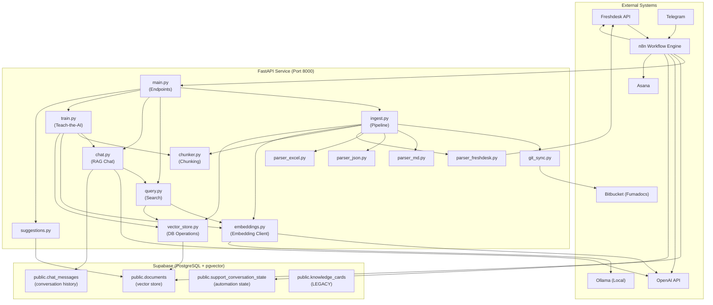
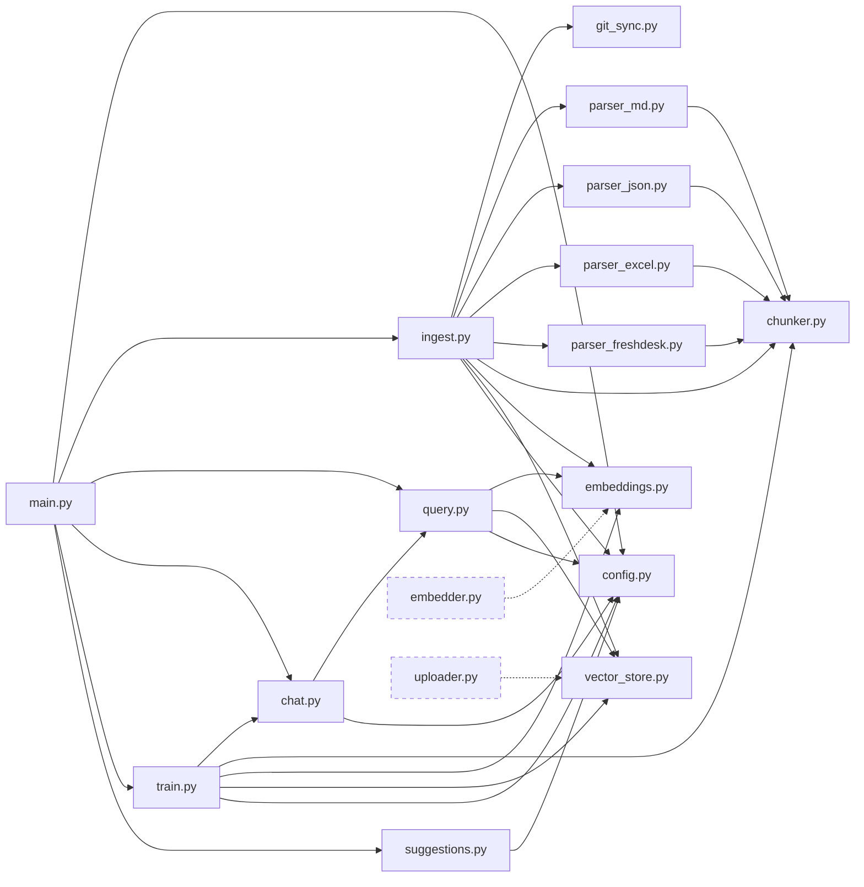
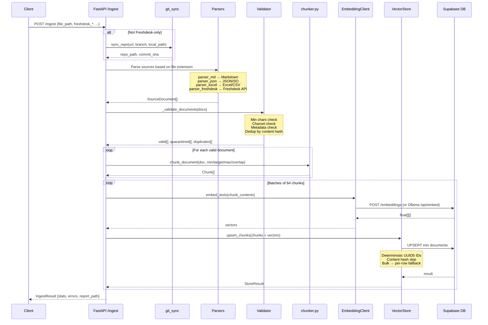
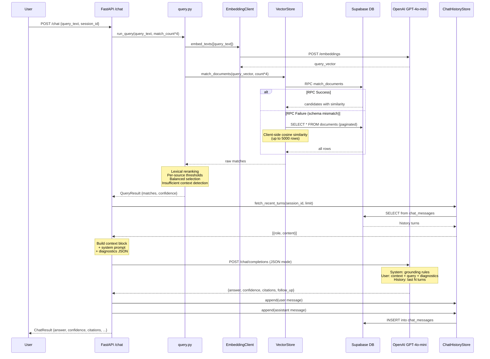
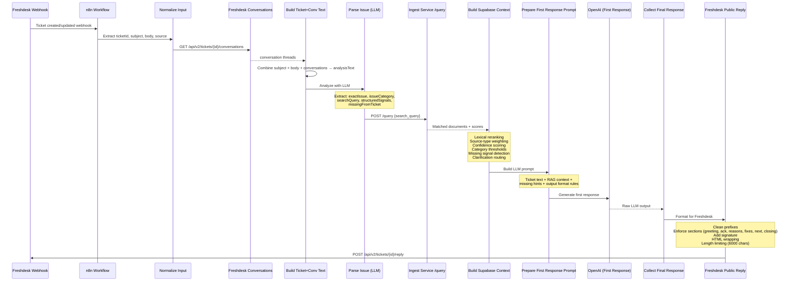
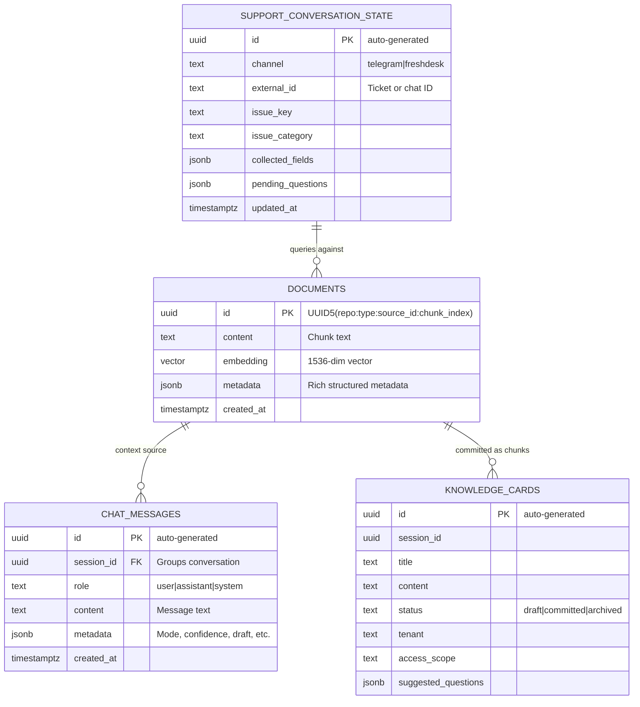
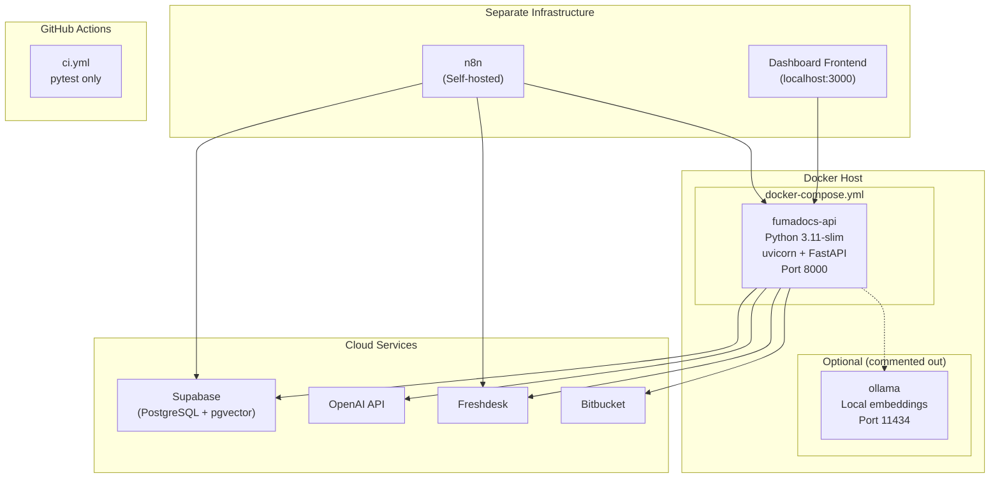
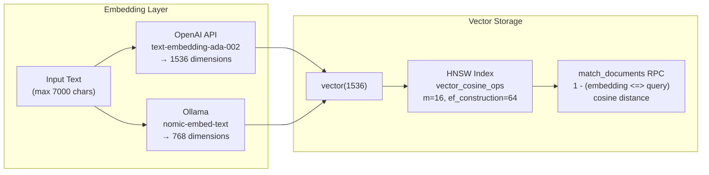
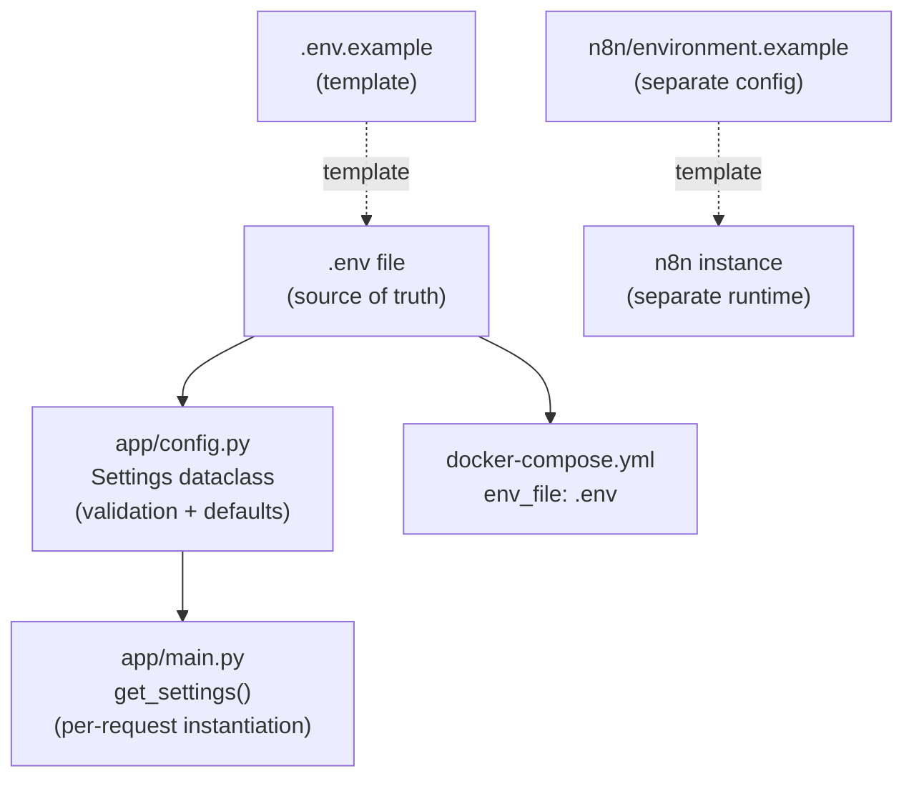
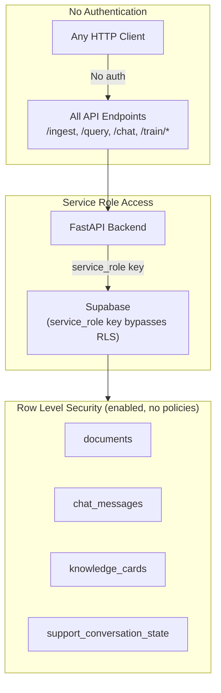

# KwikID AI Ingest — Architecture Document

> **READ-ONLY analysis** — No code was modified.

---

## 1. System Architecture Overview

---

## 2. Component Dependency Graph

---

## 3. Ingestion Pipeline — Sequence Diagram

---

## 4. RAG Chat — Sequence Diagram

---

## 5. n8n Workflow — Sequence Diagram

---

## 6. Data Model — Entity Relationships

---

## 7. Deployment Architecture

---

## 8. Embedding Dimension & Index Strategy

> [!WARNING]
> The database schema defines `vector(1536)` but the Ollama default model (`nomic-embed-text`) produces 768-dim vectors. This dimension mismatch would cause runtime errors if Ollama is used without schema adjustment.

---

## 9. Configuration Hierarchy

---

## 10. Security Architecture (As-Is)

> [!CAUTION]
> All FastAPI endpoints are publicly accessible with no authentication. The Supabase service role key (which bypasses all RLS) is used for all database operations. The `supabasesuccess.py` script at the repo root contains a hardcoded service role key.
