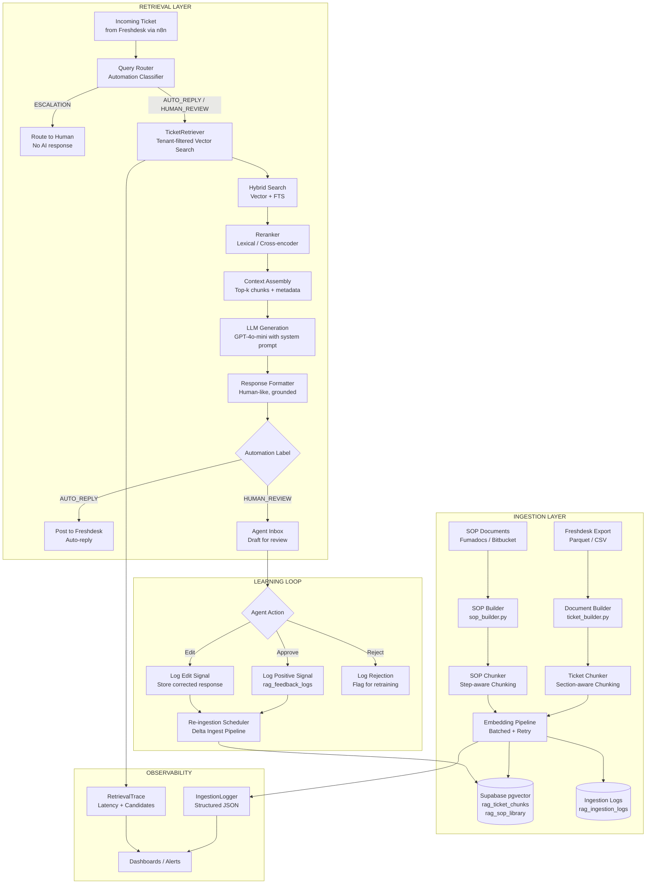

# RAG Architecture — KwikID AI Support System
## Phase B1: Vector Ingestion & Retrieval Foundation

> **Document type**: Living architecture reference  
> **Phase**: B1 — RAG Architecture + Vector Ingestion System  
> **Status**: Implemented  
> **Last updated**: 2026-05-13

---

## 1. System Overview

The KwikID AI Support System is a multi-tenant, production-grade RAG pipeline that transforms a Video-KYC support desk from fully manual to AI-assisted. Agents receive AI-drafted responses grounded in historical tickets, SOPs, and RCA documentation — and approve or edit before posting to Freshdesk.

### Core Design Principles

| Principle | Implementation |
|---|---|
| **Grounded responses** | Every AI response cites retrieved chunks; no generation without retrieval context |
| **Tenant isolation** | `client` column enforced at DB + RLS layer; cross-tenant bleed is architecturally impossible |
| **Automation classification** | Every ticket is labeled AUTO_REPLY / HUMAN_REVIEW / ESCALATION before retrieval |
| **Continuous learning** | Resolved tickets re-ingest; human feedback drives quality improvement |
| **Modularity** | Each layer (chunking, embedding, retrieval, reranking) is independently swappable |

---

## 2. End-to-End Architecture



---

## 3. Ingestion Flow — Detailed

```
Raw Artifacts (from preprocessing phase)
    ├── unified_cleaned_dataset.parquet   (3,635 AI-usable tickets)
    ├── gold_dataset.csv                  (200–400 Gold Q→A pairs)
    ├── automation_labels.csv             (all tickets with AUTO/HUMAN/ESCALATION)
    └── evaluation_dataset.json           (eval set for future scoring)

         ↓ Step 1: Load & Validate
    DataLoader reads parquet, validates required columns, drops nulls on key fields

         ↓ Step 2: Document Construction (ticket_builder.py)
    Each ticket → RagTicketDocument (Pydantic model)
    Structured text with sections: ISSUE_SUMMARY | CUSTOMER_QUERY | RESOLUTION | RCA

         ↓ Step 3: Section-aware Chunking (ticket_chunker.py)
    Each document → 2–3 chunks by logical section:
        chunk_type = ISSUE_HEADER     (subject + category + client — short, metadata-rich)
        chunk_type = QUERY_BODY       (customer complaint — semantic match target)
        chunk_type = RESOLUTION_RCA   (resolution + RCA — answer generation source)

         ↓ Step 4: Deduplication (deduplication.py)
    Content hash (SHA-256) checked against rag_ticket_chunks
    Identical hashes → skip; changed content → update; new → insert

         ↓ Step 5: Embedding Generation (batch_processor.py)
    Batched calls to OpenAI text-embedding-3-small (1536 dims)
    Retry with exponential backoff on 429/503
    Rate limiter: max 3 concurrent batches

         ↓ Step 6: Vector Upsert (pipeline.py → Supabase)
    Upsert into rag_ticket_chunks with all metadata columns
    Update rag_ticket_documents with ingestion timestamp
    Write ingestion run summary to rag_ingestion_logs

         ↓ Step 7: Observability
    IngestionLogger writes structured JSON per-run
    MetricsCollector emits: docs_processed, chunks_created, embeddings_generated,
    failures_by_type, automation_label_distribution, tenant_distribution
```

---

## 4. Retrieval Flow — Detailed

```
Incoming Support Ticket (from Freshdesk webhook → n8n)
    {
        "subject": "OTP not received",
        "description": "Customer says OTP not coming on registered mobile",
        "client": "unity_bank",
        "environment": "production"
    }

         ↓ Step 1: Query Classification
    Automation label inference (query_router) → AUTO_REPLY | HUMAN_REVIEW | ESCALATION
    If ESCALATION → short-circuit, route to human, no RAG

         ↓ Step 2: Tenant Context Extraction
    client = "unity_bank"  ← mandatory for all downstream retrieval

         ↓ Step 3: Query Embedding
    query_text = subject + " " + description[:500]
    embedding = EmbeddingProvider.embed_single(query_text)

         ↓ Step 4: Hybrid Retrieval (TicketRetriever)
    Vector search:  match_ticket_chunks(embedding, client, top_k=20, threshold=0.28)
    FTS search:     ts_rank on tsvector index (if hybrid_enabled)
    Fusion:         Reciprocal Rank Fusion (RRF k=60)

         ↓ Step 5: Metadata Filtering
    Filter out: automation_label = ESCALATION
    Boost:      has_sop = true (SOP chunks ranked higher)
    Enforce:    client = unity_bank (NO cross-tenant results)

         ↓ Step 6: Reranking (optional, hook available)
    Cross-encoder reranking on top-10 candidates
    Returns final top-5 chunks for context assembly

         ↓ Step 7: Context Assembly
    Ordered chunks:
        1. SOP chunk (if found) — highest priority
        2. Similar resolved ticket (QUERY_BODY closest match)
        3. RCA chunk from best-matching resolved ticket
        4–5. Additional context

         ↓ Step 8: LLM Generation
    System prompt enforces:
        - Use ONLY retrieved context
        - Never invent ticket IDs, session IDs, credentials
        - Never suggest backend/infra actions to customer
        - Write in human support tone (not technical dump)
    User prompt = assembled context + incoming ticket description

         ↓ Step 9: Response Routing
    AUTO_REPLY  → post directly to Freshdesk (Freshdesk API)
    HUMAN_REVIEW → save as draft in agent inbox
```

---

## 5. Metadata Strategy

Every chunk stored in `rag_ticket_chunks` carries these metadata columns (real columns, not JSONB):

| Column | Type | Purpose | Index |
|---|---|---|---|
| `client` | text | Tenant isolation — mandatory filter | B-tree |
| `automation_label` | text | Route auto-reply vs human review | B-tree |
| `query_type` | text | Category filter for SOP boosting | B-tree |
| `issue_area` | text | Sub-category drill-down | B-tree |
| `has_rca` | bool | Prioritize chunks with RCA knowledge | B-tree |
| `has_sop` | bool | Boost SOP-backed chunks | B-tree |
| `escalation_flag` | bool | Hard exclude from auto-reply | B-tree |
| `rca_quality_score` | smallint | 0–100; prefer higher quality for training | — |
| `environment` | text | prod vs UAT filtering | B-tree |
| `chunk_type` | text | ISSUE_HEADER / QUERY_BODY / RESOLUTION_RCA | B-tree |
| `embedding` | vector(1536) | IVFFlat index for ANN search | IVFFlat |

**JSONB metadata** (`extra_metadata` column) stores lower-cardinality signals:
- `session_ids`, `agent_id`, `asana_link`, `sop_status`, `source_file`, `ingestion_run_id`

---

## 6. Tenant Isolation Strategy

Tenant isolation is enforced at **three independent layers** — any single layer failing does not cause cross-tenant bleed:

### Layer 1: Application-Level Filter
Every `TicketRetriever` call requires `client` parameter. If missing → `ValueError` raised. The retriever prepends `AND client = :client` to every query.

### Layer 2: Database-Level (Supabase RLS)
```sql
-- Row-Level Security on rag_ticket_chunks
CREATE POLICY tenant_isolation ON rag_ticket_chunks
    USING (client = current_setting('app.current_tenant', true));
```
Even if application code accidentally omits the filter, RLS blocks cross-tenant reads.

### Layer 3: RPC Function Signature
The `match_ticket_chunks` RPC function has `p_client text NOT NULL` parameter. Calls without `client` fail at the database function level.

---

## 7. Continuous Learning Loop

```
New Freshdesk ticket resolved (by human or AI)
    ↓
Agent marks resolution in Freshdesk
    ↓
FeedbackIngester (feedback_loop.py) receives webhook signal
    ↓
New resolution stored in rag_feedback_logs
    ↓
Delta Ingestion Scheduler runs (daily / on-demand)
    ↓
Ticket re-ingested with updated metadata:
    - automation_label re-evaluated
    - rca_quality_score updated
    - has_sop updated if SOP was referenced
    ↓
New embedding generated only if content changed (hash-based dedup)
    ↓
rag_ticket_chunks updated via deterministic UUID upsert
    ↓
Vector index rebuilt (IVFFlat) on schedule
```

### Feedback Signal Types

| Signal | Source | Effect |
|---|---|---|
| `APPROVED` | Agent accepts AI draft unchanged | Positive: boosts similar chunks' implicit quality |
| `EDITED` | Agent modifies AI draft | Store corrected response; re-ingest with edited RCA as gold |
| `REJECTED` | Agent discards AI draft | Flag chunk for review; optionally reduce similarity threshold |
| `ESCALATED` | Ticket escalated after AI draft | Update automation_label → ESCALATION, remove from auto-reply pool |

---

## 8. Automation Classification Flow

```
                    ┌─────────────────────────────┐
                    │      Incoming Query          │
                    └──────────────┬──────────────┘
                                   │
                    ┌──────────────▼──────────────┐
                    │    Query Type Blocklist      │
                    │  (Server Alert, Deployment,  │
                    │   Internal, ID mapping...)   │
                    └──────────────┬──────────────┘
                    YES: blocklist │               NO: continue
                                   ▼
                    ┌──────────────────────────────┐
                    │   Priority Check             │
                    │   High / Urgent?             │
                    └──────────────┬───────────────┘
                    YES: ESCALATION│               NO: continue
                                   ▼
                    ┌──────────────────────────────┐
                    │   SLA Status Check           │
                    │   RCA Pending from Dev?       │
                    │   Asana ticket exists?        │
                    └──────────────┬───────────────┘
                    YES: ESCALATION│               NO: continue
                                   ▼
                    ┌──────────────────────────────┐
                    │   Recurrence Check           │
                    │   Recurring + SOP Present?   │
                    │   Agent interactions ≤ 3?    │
                    └──────────────┬───────────────┘
                    YES: AUTO_REPLY│               NO: HUMAN_REVIEW
                                   │
                                   ▼
                    ┌──────────────────────────────┐
                    │     RAG Generation           │
                    │   (if AUTO_REPLY or HUMAN_   │
                    │    REVIEW)                   │
                    └──────────────────────────────┘
```

---

## 9. Database Schema Map

```
public schema
├── documents                    (EXISTING — Fumadocs/JSON/Excel/live Freshdesk API)
│   └── vector(1536), metadata JSONB
│
├── rag_ticket_documents         (NEW — Phase B1 — one row per canonical ticket)
│   ├── ticket_id, client, query_type, issue_area
│   ├── automation_label, rca_quality_score
│   ├── has_rca, has_sop, escalation_flag
│   └── content_hash (for dedup)
│
├── rag_ticket_chunks            (NEW — Phase B1 — chunks with embeddings)
│   ├── embedding vector(1536)
│   ├── chunk_type (ISSUE_HEADER | QUERY_BODY | RESOLUTION_RCA)
│   ├── All ticket metadata as real columns (not JSONB)
│   └── IVFFlat index on embedding
│
├── rag_sop_library              (NEW — Phase B1 — SOP documents)
│   ├── embedding vector(1536)
│   ├── clients text[] (multi-tenant SOP applicability)
│   └── version int (for SOP updates without full re-ingest)
│
├── rag_ingestion_logs           (NEW — Phase B1 — ingestion run tracking)
│   └── per-run metrics, status, error summary
│
├── rag_feedback_logs            (NEW — Phase B1 — agent feedback signals)
│   └── approved/edited/rejected signals per AI response
│
└── chat_messages                (EXISTING — conversation history)
```

---

## 10. Future Scalability Recommendations

### Short-term (next 3 months)
- **Async ingestion**: Move to `asyncpg` + `asyncio` for parallel chunk embedding; reduces full ingestion from ~40min to ~8min for 3,635 tickets
- **IVFFlat tuning**: Once `rag_ticket_chunks` > 10,000 rows, set `nlist=100` for IVFFlat; run `VACUUM ANALYZE` after each bulk ingest
- **Freshdesk live webhook**: Replace batch parquet ingestion with real-time ticket creation webhook → immediate vector indexing on ticket close

### Medium-term (3–6 months)
- **Parent-child retrieval**: Store `document_id` FK; retrieve ISSUE_HEADER + RESOLUTION_RCA together when QUERY_BODY matches — reduces hallucination from incomplete context
- **Tenant-specific SOP versioning**: `rag_sop_library.version` + `updated_at` allow per-tenant SOP pushes without full re-ingest
- **Cross-encoder reranking**: Add `sentence-transformers/cross-encoder/ms-marco-MiniLM-L-6-v2` as local reranker; plug into `reranking_hook.py`

### Long-term (6+ months)
- **Fine-tuned embedding**: Domain-adapted embedding on gold dataset (support ticket query → resolution pairs); evaluate with MTEB; expect +8–12% retrieval precision
- **Agentic loop**: LangGraph agent that can: (1) retrieve, (2) decide if context is sufficient, (3) ask clarifying question, (4) retrieve again, (5) generate
- **Multi-modal**: Session recording snapshots → image embeddings for video KYC failure diagnosis

---

## 11. Future Reranking Design

The `reranking_hook.py` module exposes a `RerankingProvider` protocol. Current implementations:

| Provider | Status | Trigger |
|---|---|---|
| `LexicalReranker` | Implemented (existing) | `RERANK_ENABLED=true` |
| `CrossEncoderReranker` | Hook ready, not wired | Plug in via `RERANK_PROVIDER=cross_encoder` |
| `LLMReranker` | Hook ready, not wired | GPT-4o-mini as judge; expensive, use only for HUMAN_REVIEW path |

Reranking improves precision by re-scoring top-20 candidates from vector search. The reranker sees (query, chunk) pairs and outputs a float score. Chunks are then re-sorted before context assembly.

---

## 12. Hybrid Retrieval Design

The existing `retrieval/hybrid_search.py` implements RRF (Reciprocal Rank Fusion). For Phase B1, ticket retrieval uses:

```
hybrid_score = α × semantic_score + (1 - α) × keyword_score

Where:
  semantic_score = cosine_similarity(query_embedding, chunk_embedding)
  keyword_score  = PostgreSQL ts_rank(tsvector, tsquery)
  α = 0.7 (tunable via HYBRID_SEMANTIC_WEIGHT env var)
```

**FTS index on `rag_ticket_chunks`:**
```sql
ALTER TABLE rag_ticket_chunks
  ADD COLUMN fts_vector tsvector
  GENERATED ALWAYS AS (
    to_tsvector('english', coalesce(content, ''))
  ) STORED;

CREATE INDEX idx_rtc_fts ON rag_ticket_chunks USING GIN(fts_vector);
```

This enables keyword search for exact ticket IDs, client names, and technical terms that embeddings may miss.

---

## 13. Observability Architecture

```
Every ingestion run produces:
  ├── Console: structured log lines (JSON) via IngestionLogger
  ├── File:    data/reports/ingestion_YYYYMMDD_HHMMSS.json
  └── DB:      rag_ingestion_logs row (queryable, alertable)

Every retrieval call produces:
  ├── RetrievalTrace dataclass (existing retrieval/ module)
  │   ├── semantic_latency_ms, keyword_latency_ms, rerank_latency_ms
  │   ├── candidate counts at each stage
  │   └── final_candidates with scores
  └── Structured log line with trace_id for correlation

Key metrics to alert on:
  ├── ingestion_failure_rate > 5%  → Slack/PagerDuty alert
  ├── embedding_latency_p95 > 10s  → possible OpenAI rate limit
  ├── retrieval_zero_results > 10% → knowledge gap, needs SOP ingestion
  └── auto_reply_escalation_rate  → AI confidence quality signal
```

---

## 14. SOP Ingestion Workflow (Future)

When a new SOP is created in Fumadocs/Bitbucket:

```
1. Bitbucket webhook fires on commit to kwikid-docs-internal
2. git_sync.py pulls latest, identifies changed .md files
3. SOP files matching /sops/**/*.md → SopBuilder.build()
4. SopBuilder constructs RagSopDocument with:
     - sop_id: deterministic from file path
     - query_type: extracted from frontmatter or filename
     - clients: from frontmatter (all-tenants if not specified)
     - content: cleaned markdown text
5. Chunk into SOP_STEPS chunks (one chunk per H2/H3 section)
6. Embed and upsert into rag_sop_library
7. On retrieval: SOP chunks are weighted +0.15 similarity bonus
```

New SOPs are **live immediately** after step 6 — no system restart, no redesign.

---

## 15. AI Evaluation Workflow (Future Phase C)

The `evaluation_dataset.json` (from preprocessing) contains ~200–400 gold query→resolution pairs.

```
Offline evaluation (weekly / on PR):
  1. Load evaluation_dataset.json
  2. For each (query, expected_resolution):
       a. Run full retrieval pipeline
       b. Generate AI response
       c. Score: exact match, ROUGE-L, semantic similarity vs expected
  3. Output evaluation_report.json with:
       - per-query scores
       - precision@k for retrieval
       - hallucination flags (generated IDs not in context)
       - automation_label accuracy

Online evaluation (continuous):
  1. Log all AI responses with retrieved_chunks in rag_feedback_logs
  2. After agent action (approve/edit/reject), update feedback_logs
  3. Weekly: compute approval_rate, edit_distance, rejection_rate per client
  4. Alert if approval_rate drops below 70% for any client
```

---

## 16. Phase Roadmap

| Phase | Component | Status |
|---|---|---|
| Phase 0 | Preprocessing, dataset profiling | ✅ Complete |
| **Phase B1** | **RAG Architecture + Vector Ingestion** | **✅ Implemented (this doc)** |
| Phase B2 | Chat generation + response formatting | ⏳ Next |
| Phase B3 | Evaluation harness + quality scoring | ⏳ Planned |
| Phase B4 | Freshdesk webhook + live ingestion | ⏳ Planned |
| Phase C | Agentic loop + fine-tuned embeddings | ⏳ Future |
